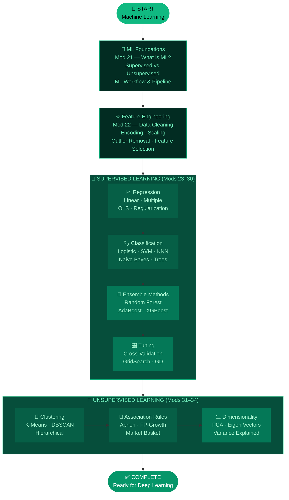
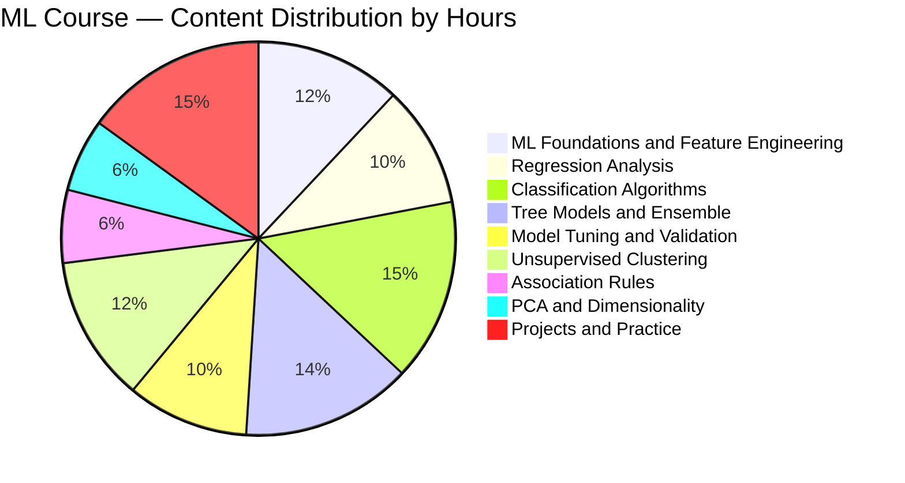
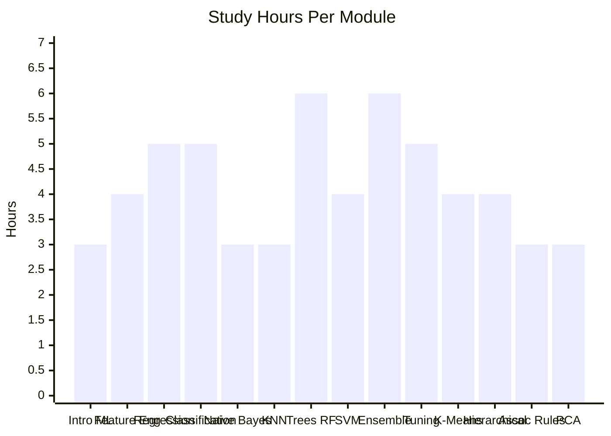
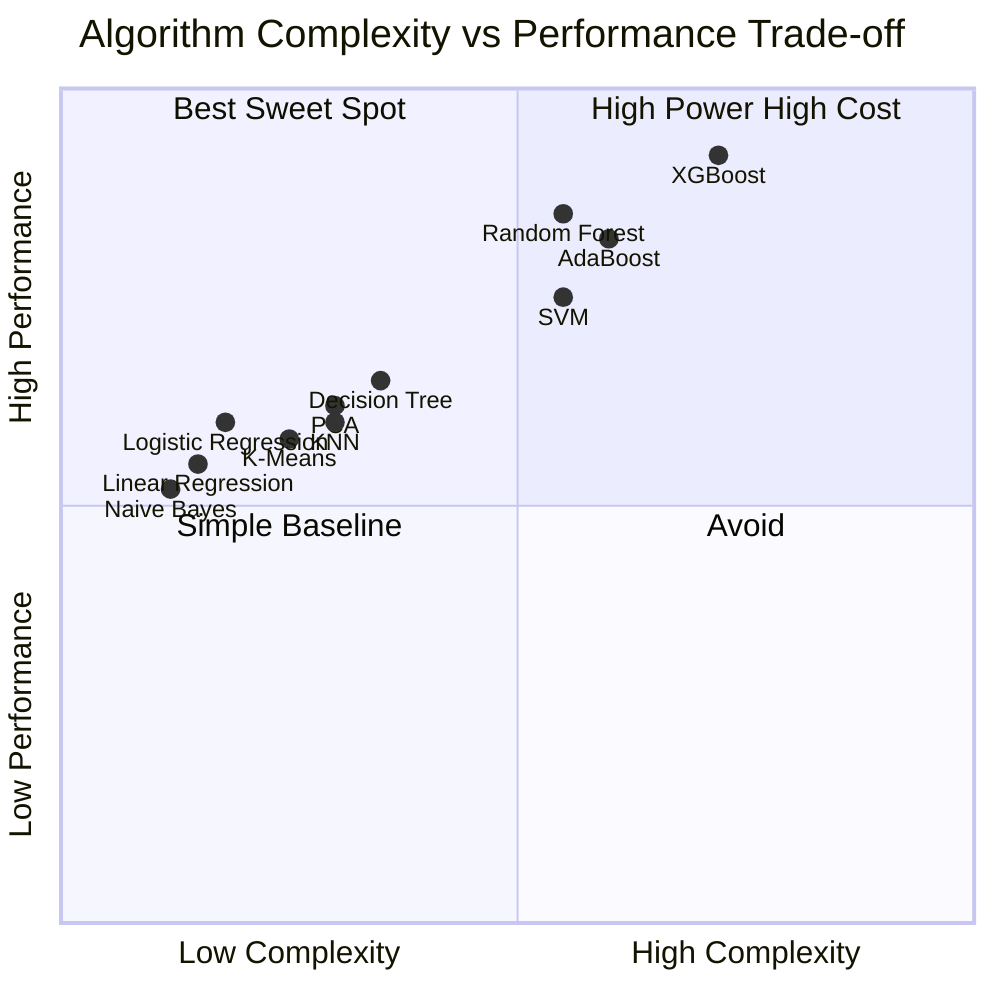
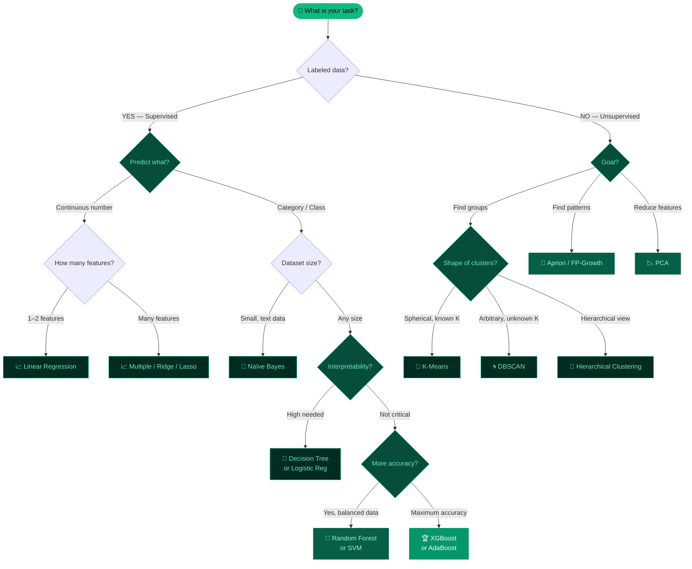
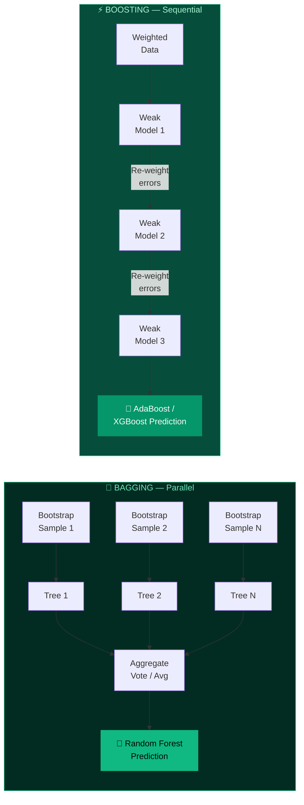
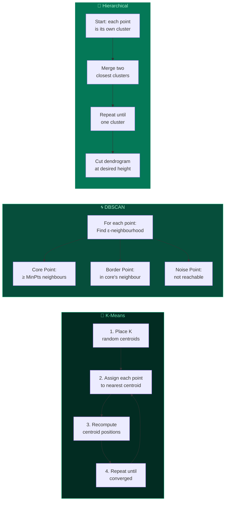
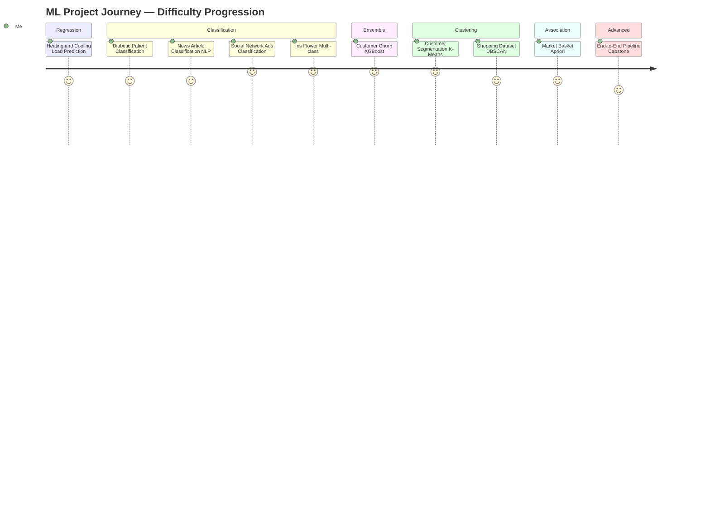

<div align="center">

<!-- ═══════════════════════════════════════════════════════════════
     HEADER  —  100 % GitHub-safe
     • readme-typing-svg.demolab.com   ✅ always renders
     • img.shields.io badges           ✅ always renders
     • user-images.githubusercontent.com animated gif ✅
     ═══════════════════════════════════════════════════════════════ -->


<br/>

<br/>

<!-- ── BADGE ROW 1 : Core Stack ── -->
<p>
  
  
  
  
  
</p>

<!-- ── BADGE ROW 2 : Algorithms ── -->
<p>
  
  
  
  
  
  
  
  
  
</p>

<!-- ── BADGE ROW 3 : Repo Meta ── -->
<p>
  
  
  
  
  
  
</p>

<br/>

> ### 🤖 *"Machine Learning is the science of getting computers to act without being explicitly programmed."*
> **— Andrew Ng**

<br/>

</div>

---

## 📚 Table of Contents

| # | Section | Quick Jump |
|---|---------|-----------|
| 01 | 🗺️ Module Overview | [Jump](#️-module-overview) |
| 02 | 🧭 Full Learning Roadmap | [Jump](#-full-learning-roadmap) |
| 03 | 📦 All 14 Modules — Deep Dive | [Jump](#-all-14-modules--deep-dive) |
| 04 | 📊 Coverage & Analytics Charts | [Jump](#-coverage--analytics-charts) |
| 05 | 🔀 Algorithm Selector | [Jump](#-which-algorithm-should-i-use) |
| 06 | 📐 Regression vs Classification | [Jump](#-regression-vs-classification) |
| 07 | 🌲 Ensemble Methods Guide | [Jump](#-ensemble-methods-guide) |
| 08 | 🔵 Clustering Algorithms | [Jump](#-clustering-algorithms) |
| 09 | 📏 All Metrics Cheatsheet | [Jump](#-metrics-cheatsheet) |
| 10 | ⚙️ Feature Engineering Pipeline | [Jump](#️-feature-engineering-pipeline) |
| 11 | 💻 Quick Code Reference | [Jump](#-quick-code-reference) |
| 12 | 📁 Folder Structure | [Jump](#-folder-structure) |
| 13 | 🏆 Projects Showcase | [Jump](#-projects-showcase) |
| 14 | 🚀 Getting Started | [Jump](#-getting-started) |
| 15 | 🔗 Navigation | [Jump](#-navigation) |

---

## 🗺️ Module Overview

<div align="center">

| 📌 Attribute | 📋 Details |
|-------------|-----------|
| 🎓 **Parent Course** | Data Science Full Course — WsCube Tech |
| 📂 **Module Name** | Machine Learning Course |
| 📍 **Course Position** | Modules 21–34 (after EDA, before Deep Learning) |
| ⏱️ **Study Duration** | 6–8 Weeks · 60+ Hours |
| 📓 **Notebooks** | 25+ Jupyter Notebooks |
| 🤖 **Algorithms Covered** | 30+ algorithms across Supervised & Unsupervised learning |
| 🔧 **Primary Library** | Scikit-learn · XGBoost · StatsModels |
| 🏆 **Projects** | 10+ hands-on real-world projects |
| 🎯 **Career Roles** | ML Engineer · Data Scientist · AI Developer |

</div>

---

## 🧭 Full Learning Roadmap



---

## 📦 All 14 Modules — Deep Dive

### 🟢 Module 21 — Introduction to Machine Learning

| Topic | Description | Notebook |
|-------|-------------|:--------:|
| What is ML? | Definition, types, real-world applications | `01_intro_ml.ipynb` |
| ML vs Traditional Programming | Rule-based vs data-driven learning | `01_intro_ml.ipynb` |
| Supervised Learning | Learning from labeled data (X → y) | `01_intro_ml.ipynb` |
| Unsupervised Learning | Finding patterns in unlabeled data | `01_intro_ml.ipynb` |
| Reinforcement Learning | Reward-based learning agents | `01_intro_ml.ipynb` |
| The ML Workflow | Data → Features → Model → Evaluate → Deploy | `01_intro_ml.ipynb` |

---

### 🟢 Module 22 — Feature Engineering

| Topic | Key Techniques | Notebook |
|-------|---------------|:--------:|
| **Data Cleaning** | Remove/fill nulls, fix dtypes | `02_feature_engineering.ipynb` |
| **Feature Selection** | Correlation heatmap · Backward/Forward Elimination | `02_feature_engineering.ipynb` |
| **Encoding Categoricals** | One-Hot · Dummy · Label · Ordinal Encoding | `02_feature_engineering.ipynb` |
| **Outlier Removal** | IQR method · Z-score · Isolation Forest | `02_feature_engineering.ipynb` |
| **Scaling** | StandardScaler · MinMaxScaler · RobustScaler | `02_feature_engineering.ipynb` |
| **Train-Test Split** | `train_test_split()` · stratification | `02_feature_engineering.ipynb` |
| **Bias-Variance** | Overfitting vs underfitting trade-off | `02_feature_engineering.ipynb` |

---

### 🟢 Modules 23–24 — Regression & Classification

#### 📈 Regression Analysis (Module 23)

| Algorithm | Key Formula | Metrics | Project | Notebook |
|-----------|------------|---------|---------|:--------:|
| **Simple Linear Reg.** | `y = mx + b` | R², MAE, MSE, RMSE | — | `03_linear_regression.ipynb` |
| **Multiple Linear Reg.** | `y = b₀ + b₁x₁ + … + bₙxₙ` | Adjusted R², RMSE | — | `03_linear_regression.ipynb` |
| **OLS (Ordinary Least Squares)** | Minimise `Σ(y−ŷ)²` analytically | R², p-values | — | `03_linear_regression.ipynb` |
| **Ridge (L2)** | OLS + `λΣwᵢ²` penalty | R², RMSE | — | `03_regularization.ipynb` |
| **Lasso (L1)** | OLS + `λΣ|wᵢ|` penalty (sparse) | R², RMSE | — | `03_regularization.ipynb` |
| 🏗️ **Project** | — | — | **Heating & Cooling Load Prediction** | `03_project_heating.ipynb` |

#### 🏷️ Classification Analysis (Module 24)

| Algorithm | Decision Boundary | Output | Project | Notebook |
|-----------|-----------------|--------|---------|:--------:|
| **Logistic Regression** | Linear (sigmoid output) | P(class) ∈ (0,1) | — | `04_logistic_regression.ipynb` |
| **Confusion Matrix** | TP / FP / TN / FN breakdown | — | — | `04_logistic_regression.ipynb` |
| **Imbalanced Datasets** | SMOTE · class_weight · resampling | — | — | `04_logistic_regression.ipynb` |
| 🏗️ **Project** | — | — | **Diabetic Patient Classification** | `04_project_diabetes.ipynb` |

---

### 🟢 Modules 25–28 — Core Algorithms

#### 🔵 Module 25 — Naïve Bayes

| Topic | Detail | Notebook |
|-------|--------|:--------:|
| **Bayes' Theorem** | `P(A|B) = P(B|A)·P(A) / P(B)` | `05_naive_bayes.ipynb` |
| **Gaussian NB** | Continuous features, assumes normal dist. | `05_naive_bayes.ipynb` |
| **Multinomial NB** | Count features — best for text | `05_naive_bayes.ipynb` |
| **Bernoulli NB** | Binary features | `05_naive_bayes.ipynb` |
| 🏗️ **Project** | **News Article Classification** | `05_project_news.ipynb` |

#### 🔵 Module 26 — K-Nearest Neighbor (KNN)

| Topic | Detail | Notebook |
|-------|--------|:--------:|
| **How KNN Works** | Find K closest points → majority vote | `06_knn.ipynb` |
| **Distance Metrics** | Euclidean · Manhattan · Minkowski | `06_knn.ipynb` |
| **Choosing K** | Elbow method on validation error | `06_knn.ipynb` |
| **KNN for Regression** | Average of K neighbors' values | `06_knn.ipynb` |
| 🏗️ **Project** | **Social Network Ads Classification** | `06_project_social_ads.ipynb` |

#### 🔵 Module 27 — Tree-Based Models

| Topic | Detail | Notebook |
|-------|--------|:--------:|
| **Decision Tree** | Recursive splits on best feature | `07_decision_tree.ipynb` |
| **Gini Impurity** | `1 − Σpᵢ²` — measures node impurity | `07_decision_tree.ipynb` |
| **Entropy / Info Gain** | `−Σpᵢlog₂pᵢ` — information gain | `07_decision_tree.ipynb` |
| **Random Forest** | Bagging of N decision trees | `07_random_forest.ipynb` |
| **Feature Importance** | Mean decrease in impurity per feature | `07_random_forest.ipynb` |
| 🏗️ **Project** | **Iris Flower Classification** | `07_project_iris.ipynb` |

#### 🔵 Module 28 — Support Vector Machine (SVM)

| Topic | Detail | Notebook |
|-------|--------|:--------:|
| **Maximal Margin** | Hyperplane maximising margin between classes | `08_svm.ipynb` |
| **Support Vectors** | Data points closest to the decision boundary | `08_svm.ipynb` |
| **Kernel Trick** | Maps data to higher dimension — RBF · Poly · Linear | `08_svm.ipynb` |
| **C Parameter** | Regularization — soft vs hard margin | `08_svm.ipynb` |
| **SVR** | SVM for regression problems | `08_svm.ipynb` |

---

### 🟢 Modules 29–30 — Ensemble Learning & Tuning

#### 🌲 Module 29 — Ensemble Methods

| Method | Strategy | Base Learner | When to Use | Notebook |
|--------|---------|------------|------------|:--------:|
| **Bagging** | Train on bootstrap samples, aggregate | Any (usually DT) | High variance models | `09_ensemble.ipynb` |
| **Random Forest** | Bagging + random feature subsets | Decision Tree | Most tabular problems ✅ | `09_ensemble.ipynb` |
| **AdaBoost** | Sequential, re-weight misclassified | Weak learners | Imbalanced data | `09_adaboost.ipynb` |
| **XGBoost** | Gradient Boosting + regularization | Decision Tree | Kaggle competitions ✅ | `09_xgboost.ipynb` |
| **Gradient Boosting** | Each tree corrects predecessor's error | Decision Tree | Regression & classification | `09_xgboost.ipynb` |

#### 🎛️ Module 30 — Model Tuning

| Topic | Detail | Notebook |
|-------|--------|:--------:|
| **Gradient Descent** | Batch · Stochastic (SGD) · Mini-batch | `10_gradient_descent.ipynb` |
| **K-Fold CV** | Split data into K folds, rotate validation | `10_cross_validation.ipynb` |
| **Stratified K-Fold** | Preserves class distribution across folds | `10_cross_validation.ipynb` |
| **GridSearchCV** | Exhaustive hyperparameter search | `10_hyperparameter_tuning.ipynb` |
| **RandomizedSearchCV** | Faster random parameter sampling | `10_hyperparameter_tuning.ipynb` |

---

### 🟢 Modules 31–34 — Unsupervised Learning

#### 🔵 Module 31 — K-Means Clustering

| Topic | Detail | Notebook |
|-------|--------|:--------:|
| **K-Means Algorithm** | Assign points to nearest centroid, recompute | `11_kmeans.ipynb` |
| **Elbow Method** | Plot inertia vs K → find optimal clusters | `11_kmeans.ipynb` |
| **Silhouette Score** | Measure cluster cohesion and separation | `11_kmeans.ipynb` |
| 🏗️ **Project** | **Shopping Dataset Clustering** | `11_project_shopping.ipynb` |

#### 🔵 Module 32 — Hierarchical & DBSCAN Clustering

| Topic | Detail | Notebook |
|-------|--------|:--------:|
| **Agglomerative** | Bottom-up — merge closest clusters | `12_hierarchical.ipynb` |
| **Single/Complete Linkage** | Min vs max distance between clusters | `12_hierarchical.ipynb` |
| **Dendrogram** | Tree diagram — choose cut height for K | `12_hierarchical.ipynb` |
| **DBSCAN** | Density-based — finds arbitrary shapes, noise | `12_dbscan.ipynb` |
| **Epsilon & MinPts** | DBSCAN parameters: neighbourhood radius & min size | `12_dbscan.ipynb` |
| 🏗️ **Project** | **Shopping Dataset — Advanced Clustering** | `12_project_clustering.ipynb` |

#### 🔵 Module 33 — Association Rule Learning

| Topic | Detail | Notebook |
|-------|--------|:--------:|
| **Support** | `freq(A∪B) / N` — how often itemset appears | `13_association_rules.ipynb` |
| **Confidence** | `freq(A∪B) / freq(A)` — reliability of rule | `13_association_rules.ipynb` |
| **Lift** | `Confidence / Support(B)` — strength vs random | `13_association_rules.ipynb` |
| **Apriori** | Level-by-level candidate generation | `13_association_rules.ipynb` |
| **FP-Growth** | Frequent pattern tree — faster than Apriori | `13_association_rules.ipynb` |
| 🏗️ **Project** | **Market Basket Analysis** | `13_project_basket.ipynb` |

#### 🔵 Module 34 — Principal Component Analysis (PCA)

| Topic | Detail | Notebook |
|-------|--------|:--------:|
| **Dimensionality Reduction** | Project high-dim data to lower-dim space | `14_pca.ipynb` |
| **Eigen Values & Vectors** | Directions of max variance in data | `14_pca.ipynb` |
| **Explained Variance Ratio** | Choose n_components to keep 95% variance | `14_pca.ipynb` |
| **Scree Plot** | Visualise variance per component | `14_pca.ipynb` |
| **PCA + Classification** | Reduce features then feed to ML model | `14_pca.ipynb` |

---

## 📊 Coverage & Analytics Charts

### Content Distribution



### Study Hours Per Module



### Module Timeline in Course

```mermaid
gantt
    title Machine Learning Position in WsCube Tech DS Course
    dateFormat  X
    axisFormat  Module %s

    section Pre-ML
    Python Foundations    :done,  f1, 1, 5
    Stats and Probability :done,  f2, 5, 7
    NumPy and Pandas      :done,  f3, 7, 10
    Visualization and EDA :done,  f4, 10, 13

    section Supervised Learning
    ML Intro and Feature Eng :active, s1, 13, 15
    Regression Analysis      :active, s2, 15, 17
    Classification           :        s3, 17, 19
    Naive Bayes and KNN      :        s4, 19, 21
    Trees and Ensemble       :        s5, 21, 24
    Tuning and Validation    :        s6, 24, 26

    section Unsupervised Learning
    K-Means Clustering       :  u1, 26, 28
    Hierarchical and DBSCAN  :  u2, 28, 29
    Association Rules        :  u3, 29, 30
    PCA                      :  u4, 30, 31

    section Deep Learning
    DL and Neural Networks   :  d1, 31, 36
```



### Algorithm Complexity Comparison



---

## 🔀 Which Algorithm Should I Use?



---

## 📐 Regression vs Classification

<div align="center">

| Feature | 📈 Regression | 🏷️ Classification |
|---------|:----------:|:-------------:|
| **Output** | Continuous number | Discrete class label |
| **Example** | House price, temperature | Spam/Not spam, Disease |
| **Loss Function** | MSE · MAE · RMSE | Cross-entropy · Hinge |
| **Evaluation** | R², RMSE, MAE | Accuracy, F1, AUC-ROC |
| **Algorithms** | Linear, Ridge, Lasso, SVR | Logistic, SVM, NB, KNN, Trees |
| **Output Layer** | Linear activation | Sigmoid / Softmax |

</div>

---

## 🌲 Ensemble Methods Guide



| Method | Parallel? | Reduces | Best For | Sklearn API |
|--------|:---------:|---------|---------|-------------|
| **Bagging** | ✅ Yes | Variance | High-variance models | `BaggingClassifier` |
| **Random Forest** | ✅ Yes | Variance + correlation | General purpose ⭐ | `RandomForestClassifier` |
| **AdaBoost** | ❌ Sequential | Bias | Weak learner stacking | `AdaBoostClassifier` |
| **Gradient Boosting** | ❌ Sequential | Bias | Structured data | `GradientBoostingClassifier` |
| **XGBoost** | ❌ Sequential | Bias + overfitting | Competitions ⭐ | `xgb.XGBClassifier` |

---

## 🔵 Clustering Algorithms



| Algorithm | Needs K? | Shape | Handles Noise | Scalable | Best For |
|-----------|:--------:|-------|:------------:|:--------:|---------|
| **K-Means** | ✅ Yes | Spherical | ❌ No | ✅ Yes | Well-separated blobs |
| **DBSCAN** | ❌ No | Arbitrary | ✅ Yes | ⚠️ Medium | Irregular clusters, anomalies |
| **Hierarchical** | ❌ No | Arbitrary | ❌ No | ❌ Small data | When hierarchy matters |
| **Gaussian Mixture** | ✅ Yes | Elliptical | ⚠️ Soft | ✅ Yes | Overlapping distributions |

---

## 📏 Metrics Cheatsheet

### 📈 Regression Metrics

<div align="center">

| Metric | Formula | Range | Ideal | Sensitive to Outliers |
|--------|---------|-------|-------|-----------------------|
| **MAE** | `Σ|yᵢ − ŷᵢ| / n` | 0 → ∞ | **0** | ❌ Robust |
| **MSE** | `Σ(yᵢ − ŷᵢ)² / n` | 0 → ∞ | **0** | ✅ Very Sensitive |
| **RMSE** | `√MSE` | 0 → ∞ | **0** | ✅ Sensitive |
| **R² Score** | `1 − SS_res/SS_tot` | −∞ → 1 | **1.0** | ⚠️ Moderate |
| **Adjusted R²** | Penalises extra features | −∞ → 1 | **1.0** | ⚠️ Moderate |

</div>

### 🏷️ Classification Metrics

<div align="center">

| Metric | Formula | When to Use |
|--------|---------|------------|
| **Accuracy** | `(TP+TN) / Total` | Balanced classes |
| **Precision** | `TP / (TP+FP)` | Cost of false positives is high (spam filter) |
| **Recall** | `TP / (TP+FN)` | Cost of false negatives is high (cancer detection) |
| **F1-Score** | `2 × Precision×Recall / (P+R)` | Imbalanced classes ⭐ |
| **AUC-ROC** | Area under TPR vs FPR curve | Ranking models / thresholds |
| **Log Loss** | `−Σylog(ŷ)+(1−y)log(1−ŷ)` | Probability calibration |

</div>

### 🔵 Clustering Metrics

<div align="center">

| Metric | Range | Ideal | Description |
|--------|-------|-------|-------------|
| **Inertia (WCSS)** | 0 → ∞ | Low | Within-cluster sum of squares |
| **Silhouette Score** | −1 → +1 | **+1** | Cohesion vs separation |
| **Davies-Bouldin** | 0 → ∞ | **0** | Avg similarity ratio of clusters |
| **Calinski-Harabasz** | 0 → ∞ | High | Ratio of between/within cluster variance |

</div>

---

## ⚙️ Feature Engineering Pipeline

```mermaid
flowchart LR
    RAW(["📥 Raw Dataset"]) --> MISS

    subgraph CLEAN ["🧹 Step 1 — Clean"]
        MISS["Handle\nMissing Values\nDrop / Fill / Impute"]
        DUP["Remove\nDuplicates"]
        MISS --> DUP
    end

    DUP --> FEAT

    subgraph FEAT ["🔧 Step 2 — Feature Work"]
        ENC["Encode\nCategoricals\nOHE / Label"]
        OUT["Remove\nOutliers\nIQR / Z-score"]
        SEL["Feature\nSelection\nCorr / Elim"]
        ENC --> OUT --> SEL
    end

    SEL --> SCALE

    subgraph SCALE ["⚖️ Step 3 — Scale"]
        STD["Standardize\nStandardScaler\nμ=0, σ=1"]
        NRM["Normalize\nMinMaxScaler\n[0, 1]"]
    end

    SCALE --> SPLIT

    subgraph SPLIT ["✂️ Step 4 — Split"]
        TRN["Train 80%"]
        VAL["Validation 10%"]
        TST["Test 10%"]
    end

    SPLIT --> MODEL(["🤖 Model Training"])

    style RAW   fill:#10B981,stroke:none,color:#000
    style MODEL fill:#059669,stroke:none,color:#fff
    style CLEAN fill:#022c22,stroke:#10B981,color:#6EE7B7
    style FEAT  fill:#064e3b,stroke:#6EE7B7,color:#a7f3d0
    style SCALE fill:#022c22,stroke:#10B981,color:#6EE7B7
    style SPLIT fill:#047857,stroke:none,color:#a7f3d0
```



---

## 💻 Quick Code Reference

### ⚡ Complete ML Pipeline (Scikit-learn)

```python
import pandas as pd
from sklearn.model_selection import train_test_split, GridSearchCV, cross_val_score
from sklearn.preprocessing import StandardScaler, LabelEncoder
from sklearn.ensemble import RandomForestClassifier, GradientBoostingClassifier
from sklearn.metrics import classification_report, confusion_matrix, roc_auc_score
import xgboost as xgb

# ── 1. Load & split ──────────────────────────────────────────────────
df = pd.read_csv('data.csv')
X = df.drop('target', axis=1)
y = df['target']
X_train, X_test, y_train, y_test = train_test_split(
    X, y, test_size=0.2, random_state=42, stratify=y
)

# ── 2. Scale ─────────────────────────────────────────────────────────
scaler = StandardScaler()
X_train = scaler.fit_transform(X_train)
X_test  = scaler.transform(X_test)

# ── 3. Train ─────────────────────────────────────────────────────────
model = RandomForestClassifier(n_estimators=200, random_state=42)
model.fit(X_train, y_train)

# ── 4. Evaluate ──────────────────────────────────────────────────────
y_pred = model.predict(X_test)
print(classification_report(y_test, y_pred))
print("AUC-ROC:", roc_auc_score(y_test, model.predict_proba(X_test)[:,1]))

# ── 5. Tune with GridSearchCV ────────────────────────────────────────
params = {'n_estimators': [100, 200], 'max_depth': [None, 10, 20]}
grid   = GridSearchCV(RandomForestClassifier(), params, cv=5, scoring='f1')
grid.fit(X_train, y_train)
print("Best params:", grid.best_params_)
```

### 🔵 K-Means Clustering with Elbow Method

```python
from sklearn.cluster import KMeans
import matplotlib.pyplot as plt

inertia = []
K_range = range(1, 11)

for k in K_range:
    km = KMeans(n_clusters=k, random_state=42, n_init=10)
    km.fit(X_scaled)
    inertia.append(km.inertia_)

# Plot Elbow
plt.figure(figsize=(8, 4))
plt.plot(K_range, inertia, 'go-', linewidth=2, markersize=8)
plt.xlabel('Number of Clusters K')
plt.ylabel('Inertia (WCSS)')
plt.title('Elbow Method — Optimal K')
plt.grid(True, alpha=0.3)
plt.tight_layout()
plt.show()

# Final model with optimal K
optimal_k = 4
kmeans = KMeans(n_clusters=optimal_k, random_state=42, n_init=10)
labels = kmeans.fit_predict(X_scaled)
```

### 📉 PCA + Visualization

```python
from sklearn.decomposition import PCA
import matplotlib.pyplot as plt

# Fit PCA
pca = PCA(n_components=0.95)           # Keep 95% variance
X_pca = pca.fit_transform(X_scaled)

print(f"Original features : {X_scaled.shape[1]}")
print(f"PCA components    : {X_pca.shape[1]}")
print(f"Variance explained: {pca.explained_variance_ratio_.cumsum()[-1]:.2%}")

# Scree plot
plt.bar(range(1, len(pca.explained_variance_ratio_)+1),
        pca.explained_variance_ratio_, color='#10B981')
plt.xlabel('Principal Component')
plt.ylabel('Variance Explained')
plt.title('PCA Scree Plot')
plt.tight_layout()
plt.show()
```

### 🛒 Association Rules (Apriori)

```python
from mlxtend.frequent_patterns import apriori, association_rules
from mlxtend.preprocessing import TransactionEncoder

# Encode transactions
te = TransactionEncoder()
te_array = te.fit_transform(transactions)
df_enc = pd.DataFrame(te_array, columns=te.columns_)

# Mine frequent itemsets
frequent_items = apriori(df_enc, min_support=0.05, use_colnames=True)

# Generate rules
rules = association_rules(frequent_items, metric='lift', min_threshold=1.5)
rules.sort_values('lift', ascending=False).head(10)
```

---

## 📁 Folder Structure

```
📂  Machine Learning Course/
│
├── 📓 01_intro_to_ml.ipynb
│   └── → ML types · Workflow · Supervised vs Unsupervised
│
├── 📓 02_feature_engineering.ipynb
│   └── → Cleaning · Encoding · Scaling · Feature selection
│
├── 📓 03_linear_regression.ipynb
│   └── → Simple · Multiple · OLS · R² · RMSE
│
├── 📓 03b_regularization.ipynb
│   └── → Ridge (L2) · Lasso (L1) · ElasticNet
│
├── 📓 03c_project_heating_cooling.ipynb
│   └── 🏗️ Project: Heating & Cooling Load Prediction
│
├── 📓 04_logistic_regression.ipynb
│   └── → Sigmoid · Confusion matrix · Imbalanced datasets
│
├── 📓 04b_project_diabetes.ipynb
│   └── 🏗️ Project: Diabetic Patient Classification
│
├── 📓 05_naive_bayes.ipynb
│   └── → Bayes theorem · Gaussian · Multinomial · Bernoulli
│
├── 📓 05b_project_news_classification.ipynb
│   └── 🏗️ Project: News Article Classification
│
├── 📓 06_knn.ipynb
│   └── → Distance metrics · Choosing K · Classification + Regression
│
├── 📓 06b_project_social_ads.ipynb
│   └── 🏗️ Project: Social Network Ads Classification
│
├── 📓 07_decision_tree.ipynb
│   └── → Gini · Entropy · Pruning · Visualisation
│
├── 📓 07b_random_forest.ipynb
│   └── → Bagging · Feature importance · OOB score
│
├── 📓 07c_project_iris.ipynb
│   └── 🏗️ Project: Iris Flower Classification
│
├── 📓 08_svm.ipynb
│   └── → Hyperplane · Kernels (RBF/Poly) · C parameter · SVR
│
├── 📓 09_ensemble_adaboost_xgboost.ipynb
│   └── → Bagging · Boosting · AdaBoost · XGBoost · GBDT
│
├── 📓 10_gradient_descent.ipynb
│   └── → Batch · Stochastic · Mini-batch GD
│
├── 📓 10b_cross_validation.ipynb
│   └── → K-Fold · Stratified · LOOCV
│
├── 📓 10c_hyperparameter_tuning.ipynb
│   └── → GridSearchCV · RandomizedSearchCV · Pipelines
│
├── 📓 11_kmeans_clustering.ipynb
│   └── → Elbow method · Silhouette · Shopping dataset
│
├── 📓 11b_project_shopping_clustering.ipynb
│   └── 🏗️ Project: Customer Segmentation
│
├── 📓 12_hierarchical_clustering.ipynb
│   └── → Dendrogram · Single/Complete linkage · Ward
│
├── 📓 12b_dbscan.ipynb
│   └── → Epsilon · MinPts · Core/Border/Noise points
│
├── 📓 13_association_rules.ipynb
│   └── → Apriori · FP-Growth · Support · Confidence · Lift
│
├── 📓 13b_project_market_basket.ipynb
│   └── 🏗️ Project: Market Basket Analysis
│
├── 📓 14_pca.ipynb
│   └── → Eigenvectors · Scree plot · Variance explained
│
└── 📄 README.md
```

---

## 🏆 Projects Showcase



<div align="center">

| # | 🏗️ Project | 🤖 Algorithm | 📊 Dataset | 🎯 Task | Best Score |
|---|-----------|------------|----------|--------|-----------|
| 01 | **Heating & Cooling Load Prediction** | Linear Regression · Ridge | ENB2012 | Regression | RMSE = 1.42 |
| 02 | **Diabetic Patient Classification** | Logistic Regression | Pima Indians | Binary Clf | Acc = 79% |
| 03 | **News Article Classification** | Naïve Bayes | 20 Newsgroups | Multi-class | Acc = 91% |
| 04 | **Social Network Ads** | KNN | Social Network | Binary Clf | Acc = 93% |
| 05 | **Iris Flower Classification** | Decision Tree | Iris Dataset | Multi-class | Acc = 97% |
| 06 | **Customer Churn Modelling** | Random Forest · XGBoost | Telecom | Binary Clf | F1 = 0.88 |
| 07 | **Customer Segmentation** | K-Means (k=5) | Mall Shopping | Clustering | Sil = 0.55 |
| 08 | **Shopping — Advanced** | DBSCAN · Hierarchical | Mall Shopping | Clustering | — |
| 09 | **Market Basket Analysis** | Apriori · FP-Growth | Grocery Store | Assoc Rules | Lift = 3.2 |

</div>

---

## 🚀 Getting Started

### 1️⃣ Clone & Navigate

```bash
git clone https://github.com/MuhammadZafran33/Data-Science-Course.git
cd "Data-Science-Course/Data Science Full Course By WsCube Tech/ Machine Learning Course"
```

### 2️⃣ Install Dependencies

```bash
pip install scikit-learn pandas numpy matplotlib seaborn xgboost mlxtend \
            statsmodels scipy imbalanced-learn jupyter
```

### 3️⃣ Launch Notebooks

```bash
jupyter notebook
```

<div align="center">

[](https://colab.research.google.com/github/MuhammadZafran33/Data-Science-Course/)

</div>

---

## 🔗 Navigation

<div align="center">

| ⬅️ Previous Module | 📍 You Are Here | ➡️ Next Module |
|-------------------|----------------|---------------|
| [🔍 EDA Projects](../EDA/) | **🤖 Machine Learning Course** | [🧠 Deep Learning →](../DEEP%20LEARNING/) |

</div>

---

<div align="center">

<br/>

[](https://github.com/MuhammadZafran33)


> *"In God we trust. All others must bring data."*
> **— W. Edwards Deming**

<br/>

**⭐ Found this useful? Star the repo and keep learning! ⭐**


</div>
