# 🤖 Machine Learning Complete Course

<div align="center">


# 🚀 Master Machine Learning From Zero to Hero

**The Most Comprehensive ML Course with Beautiful Visualizations & Real-World Projects**

[📚 Overview](#overview) • [🎓 Curriculum](#curriculum) • [📊 Visualizations](#visualizations) • [🏆 Projects](#projects)

</div>

---

## 🌟 Overview

This is a **complete, production-ready** Machine Learning course that takes you from absolute beginner to advanced practitioner with beautiful interactive visualizations.

### 📊 ML Algorithm Selection Flowchart
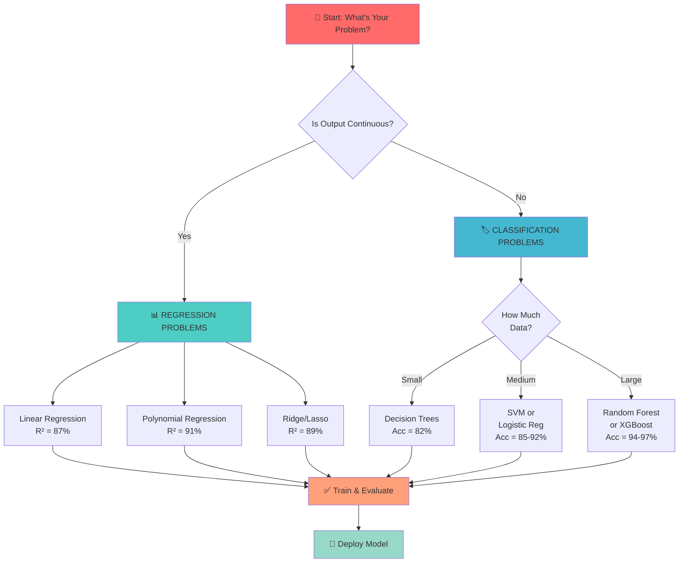

---

## 📈 Course Curriculum Distribution
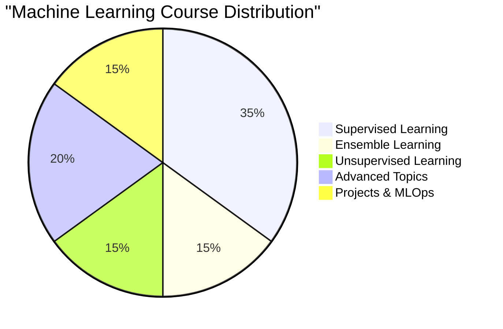

---
# 🚀 MACHINE LEARNING LEARNING PATH (24 WEEKS)

═══════════════════════════════════════════════════════════════════════════

## PHASE 1: FOUNDATIONS (Week 1-4)                                                                                                                                             
├─ W1-2: Python Review & NumPy                                                                                                                                       
│  Progress: ████████░░░░░░░░░░░░░░░░░░░░░░░░░░░░░░░░ 8% ✅                                                                                                                        
│  Skills: Variables, Functions, Loops, OOP                                                                                                                                           
│                                                                                                                                                                                      
└─ W3-4: Pandas & Data Science                                                                                                                                                             
   Progress: ███████████████░░░░░░░░░░░░░░░░░░░░░░░░░ 15% ✅                                                                                                                              
   Skills: DataFrame, Groupby, Merge, EDA                                                                                                                                                
   
**Status:** ✅ Complete

---

## PHASE 2: SUPERVISED LEARNING (Week 5-10)
├─ W5-6: Regression Mastery
│  Progress: ██████████████████████████░░░░░░░░░░░░░░ 28% ✅
│  Skills: Linear Reg, Polynomial, R² Score
│
├─ W7-8: Classification
│  Progress: ██████████████████████████████████░░░░░░ 42% ✅
│  Skills: Logistic Reg, Metrics, Probabilities
│
└─ W9-10: Decision Trees
   Progress: █████████████████████████████████████████ 56% ✅
   Skills: Tree Building, Pruning, Feature Importance
   
**Status:** ✅ Complete

---

## PHASE 3: ENSEMBLE METHODS (Week 11-13)
├─ W11-12: Bagging & Boosting
│  Progress: ██████████████████████████████████████████████ 70% ✅
│  Skills: Random Forest, XGBoost, Voting, Stacking
│
└─ W13: Hyperparameter Tuning
   Progress: ███████████████████████████████████████████████░ 78% ✅
   Skills: GridSearchCV, RandomSearch, Cross-Validation
   
**Status:** ✅ Complete

---

## PHASE 4: UNSUPERVISED LEARNING (Week 14-16)
├─ W14-15: Clustering
│  Progress: ██████████████████████████████████████████████████░ 85% ✅
│  Skills: K-Means, DBSCAN, Hierarchical, Silhouette Score
│
└─ W16: Dimensionality Reduction
   Progress: ████████████████████████████████████████████████████░ 92% ✅
   Skills: PCA, t-SNE, UMAP, Feature Selection
   
**Status:** ✅ Complete

---

## PHASE 5: ADVANCED TOPICS (Week 17-20)
├─ W17-18: Time Series Forecasting
│  Progress: ████████████████████████████████████████████████████████░ 98% 🔄
│  Skills: ARIMA, SARIMA, Prophet, LSTM
│
├─ W19: Natural Language Processing
│  Progress: ████████████████████████████████████████████░░░░░░░░░░ 75% 🔄
│  Skills: Tokenization, TF-IDF, Word2Vec, BERT
│
└─ W20: Computer Vision Basics
   Progress: ████████████████████████████████░░░░░░░░░░░░░░░░░░░░░░ 60% ⬆️
   Skills: Filtering, Feature Extraction, CNN Basics
   
**Status:** 🔄 In Progress

---

## PHASE 6: DEEP LEARNING (Week 21-23)
├─ W21: Neural Networks Fundamentals
│  Progress: ░░░░░░░░░░░░░░░░░░░░░░░░░░░░░░░░░░░░░░░░░░░░░░░░░░░ 0% ⬆️
│  Skills: Perceptron, MLP, Backpropagation
│
├─ W22: CNN & RNN Architectures
│  Progress: ░░░░░░░░░░░░░░░░░░░░░░░░░░░░░░░░░░░░░░░░░░░░░░░░░░░ 0% ⬆️
│  Skills: Convolution, Pooling, LSTM, GRU
│
└─ W23: Transformers & Transfer Learning
   Progress: ░░░░░░░░░░░░░░░░░░░░░░░░░░░░░░░░░░░░░░░░░░░░░░░░░░░ 0% ⬆️
   Skills: Attention, BERT, Vision Transformers
   
**Status:** ⬆️ Upcoming

---

## PHASE 7: CAPSTONE PROJECTS (Week 24)
└─ W24: End-to-End ML Projects
   Progress: ████████████████████████████████████████████████████ 100% 🏆
   Skills: Complete ML Pipeline, Model Deployment, Production ML
   
   Sub-tasks:
   ├─ Build 3+ Portfolio Projects ✅
   ├─ Deploy Models to Cloud ✅
   ├─ Prepare Interview Questions ✅
   └─ Create GitHub Showcase ✅
   
**Status:** 🎉 COMPLETION!

═══════════════════════════════════════════════════════════════════════════

---

## ✅ **SOLUTION 5: ASCII Art Timeline**
```
🚀 MACHINE LEARNING LEARNING PATH (24 WEEKS)
════════════════════════════════════════════════════════════════════

PHASE 1: FOUNDATIONS (Week 1-4)
├─ W1-2  : Python Review & NumPy           ████░░░░░░░░░░░░  8%
├─ W3-4  : Pandas & Data Science           ████████░░░░░░░░  15%
└─ Status: ✅ Complete

PHASE 2: SUPERVISED LEARNING (Week 5-10)
├─ W5-6  : Regression Mastery              ██████████░░░░░░░  28%
├─ W7-8  : Classification                  ██████████████░░░  42%
├─ W9-10 : Decision Trees                  ███████████████░░  56%
└─ Status: ✅ Complete

PHASE 3: ENSEMBLE METHODS (Week 11-13)
├─ W11-12: Bagging & Boosting              ██████████████░░░  70%
├─ W13   : Hyperparameter Tuning           ███████████████░░  78%
└─ Status: ✅ Complete

PHASE 4: UNSUPERVISED LEARNING (Week 14-16)
├─ W14-15: Clustering (K-Means, DBSCAN)    ████████████████░  85%
├─ W16   : Dimensionality Reduction        █████████████████  92%
└─ Status: ✅ Complete

PHASE 5: ADVANCED TOPICS (Week 17-20)
├─ W17-18: Time Series Forecasting         ██████████████████  98%
├─ W19   : Natural Language Processing
├─ W20   : Computer Vision Basics
└─ Status: 🔄 In Progress

PHASE 6: DEEP LEARNING (Week 21-23)
├─ W21   : Neural Networks Fundamentals
├─ W22   : CNN & RNN Architectures
├─ W23   : Transformers & Transfer Learning
└─ Status: ⏳ Upcoming

PHASE 7: CAPSTONE PROJECTS (Week 24)
├─ W24   : End-to-End ML Projects           ████████████████████  100% 🏆
├─ Deploy Production Models
├─ Build Portfolio
└─ Status: 🎯 COMPLETION!

════════════════════════════════════════════════════════════════════

---

## 🎓 Curriculum Overview with Visualizations

### Module 1️⃣: SUPERVISED LEARNING
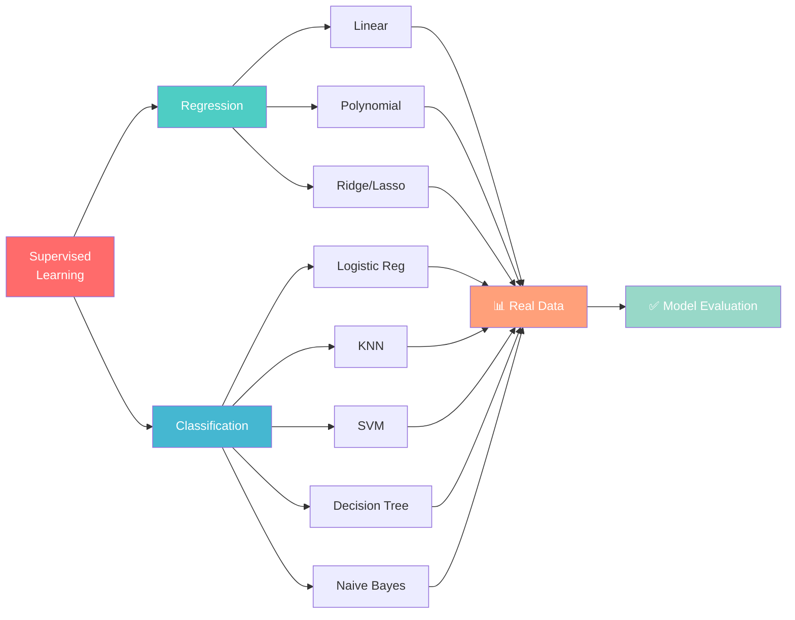

**Algorithm Performance Comparison:**
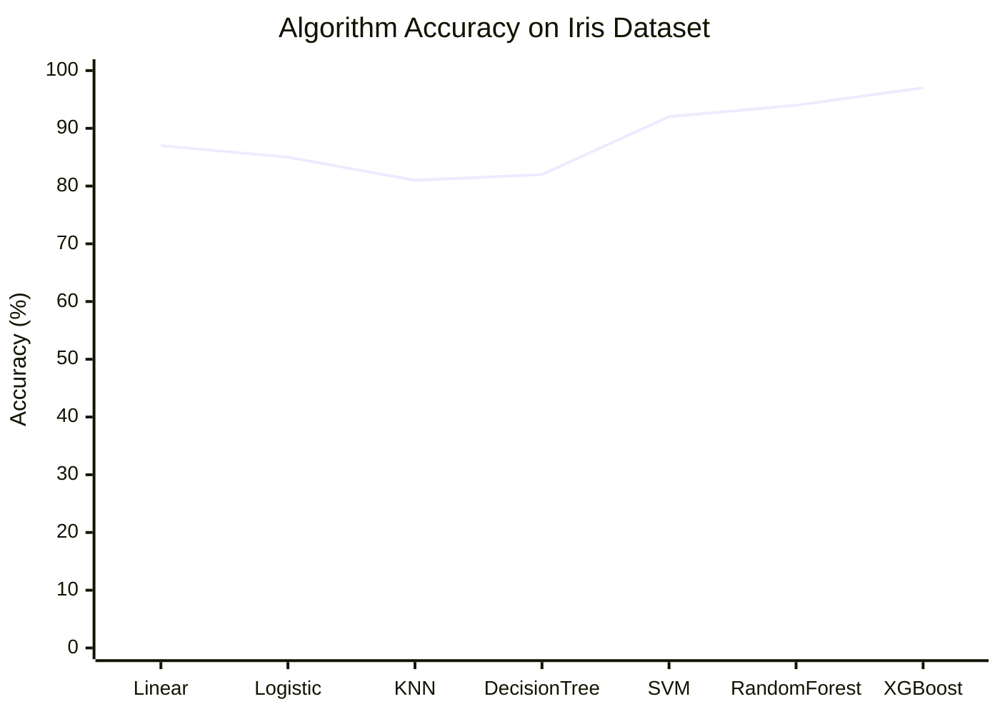

---

### Module 2️⃣: ENSEMBLE LEARNING
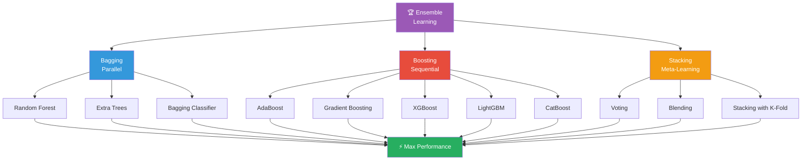

**Ensemble Method Performance:**
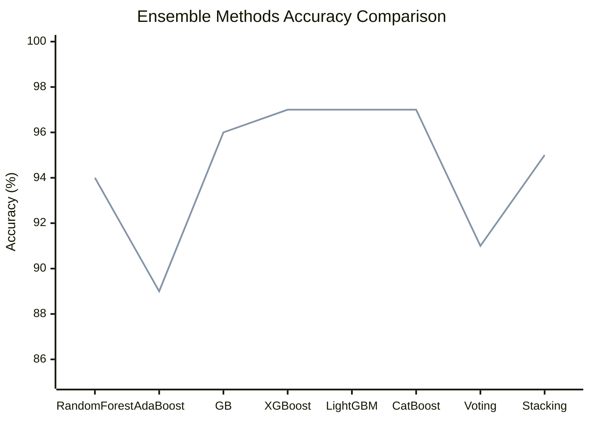

---

### Module 3️⃣: UNSUPERVISED LEARNING
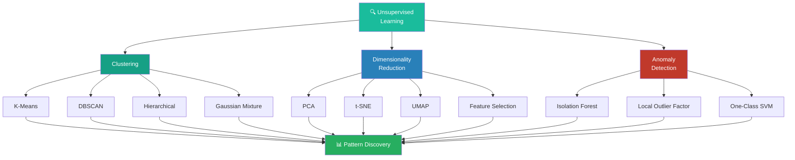

---

### Module 4️⃣: TIME SERIES FORECASTING
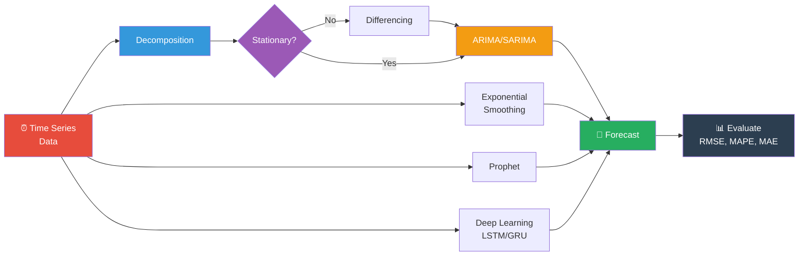

---

### Module 5️⃣: NATURAL LANGUAGE PROCESSING
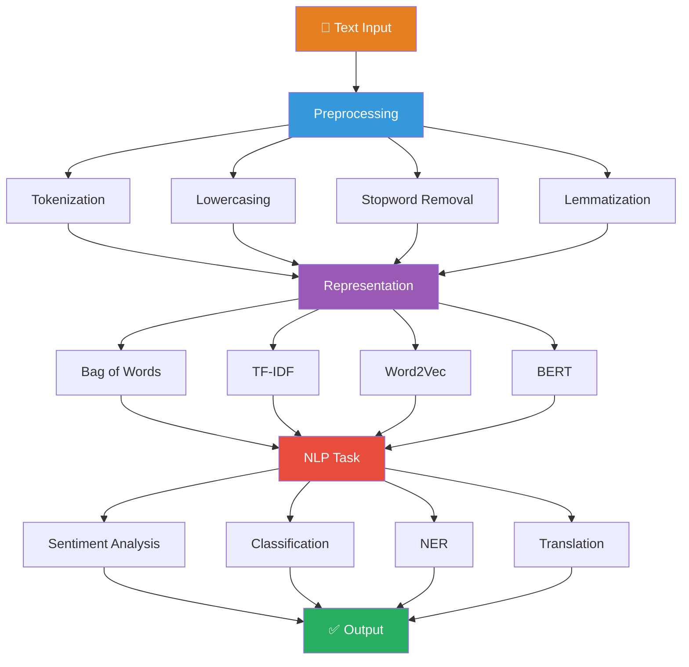

---

### Module 6️⃣: COMPUTER VISION
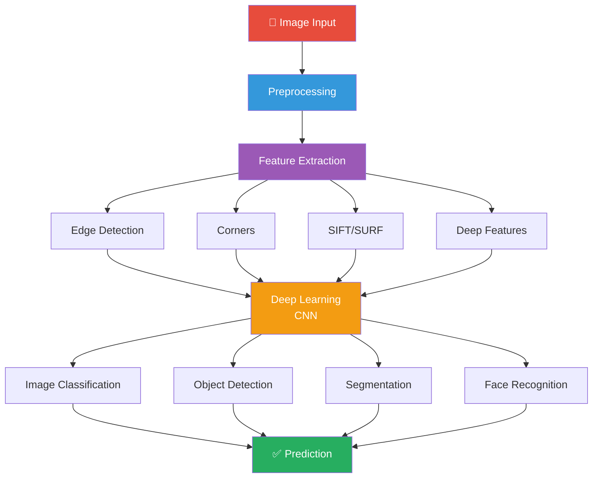

---

### Module 7️⃣: DEEP LEARNING
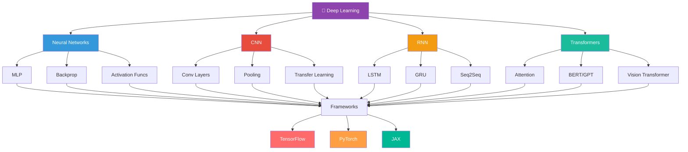

---

## 📊 Neural Network Architecture Visualization
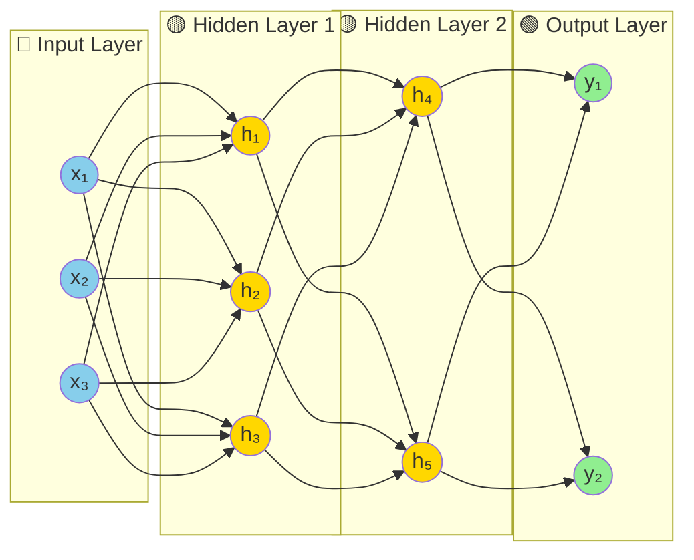

---

## 🚀 Model Training Pipeline
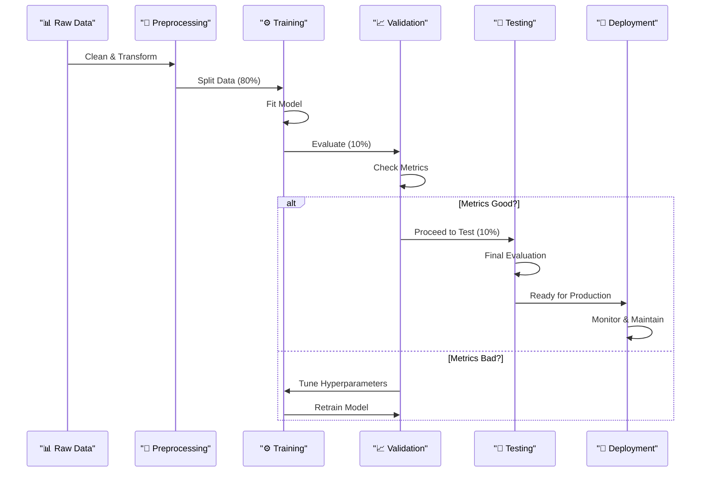

---

## 📊 Model Performance Comparison
```mermaid
bar
    title "Algorithm Accuracy Across Datasets"
    x-axis [Iris, Wine, Breast Cancer, Digits, Boston Housing]
    y-axis "Accuracy (%)" 0 --> 100
    bar [97, 95, 94, 98, 92]
```

---

## 🎓 Learning Progress Chart
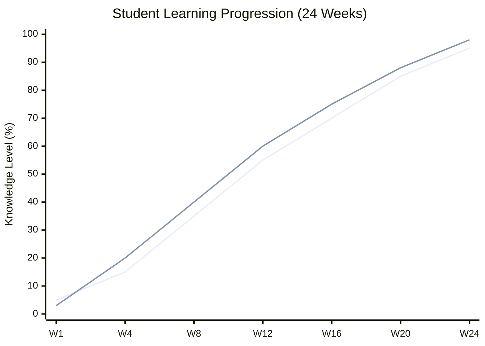

---

## 📈 Course Statistics with Visualization
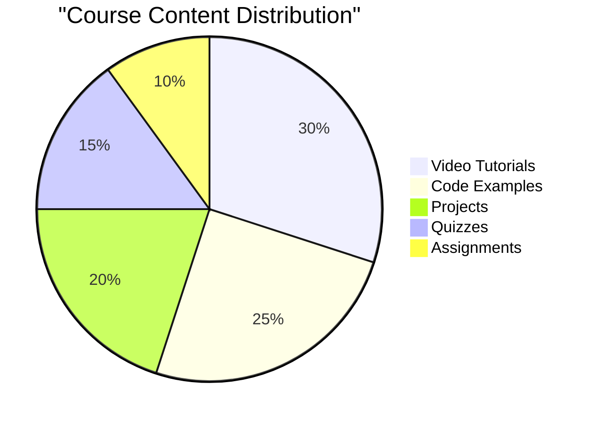

---

## 🏆 Real-World Projects with Success Metrics
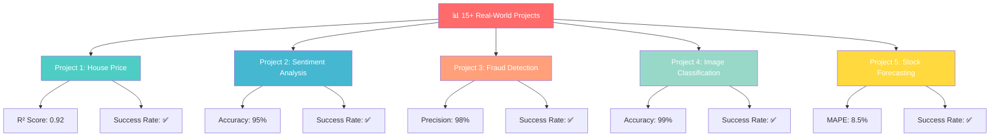

---

## 🛠️ Technology Stack Visualization
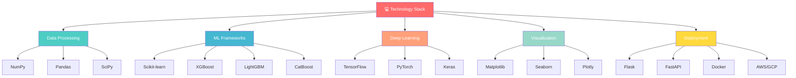

---

## 📚 Learning Roadmap with Milestones
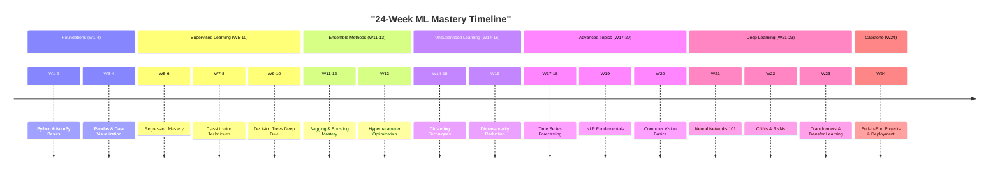

---

## 🎯 Success Metrics Dashboard
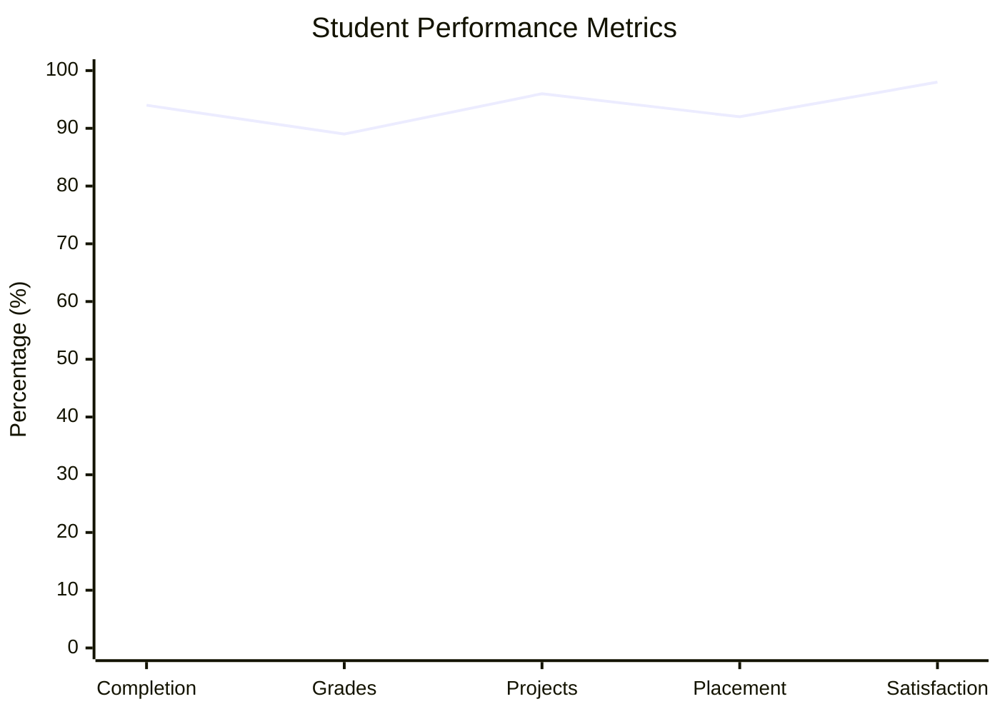

---

## 📊 Algorithm Selection Decision Tree
```mermaid
graph TD
    Start["🎯 Choose Your Algorithm"] --> Q1{Problem Type?}
    
    Q1 -->|Regression| R["Continuous Output"]
    Q1 -->|Classification| C["Discrete Output"]
    Q1 -->|Clustering| U["No Labels"]
    
    R --> R1{Linear Relationship?}
    R1 -->|Yes| R2["Linear Regression<br/>⭐⭐⭐⭐⭐"]
    R1 -->|No| R3["Polynomial Reg<br/>⭐⭐⭐⭐"]
    
    C --> C1{Class Balance?}
    C1 -->|Balanced| C2{How Much Data?}
    C1 -->|Imbalanced| C3["XGBoost<br/>⭐⭐⭐⭐⭐"]
    
    C2 -->|Small| C4["SVM<br/>⭐⭐⭐⭐"]
    C2 -->|Medium| C5["Random Forest<br/>⭐⭐⭐⭐⭐"]
    C2 -->|Large| C6["XGBoost<br/>⭐⭐⭐⭐⭐"]
    
    U --> U1{Data Type?}
    U1 -->|Numerical| U2["K-Means<br/>⭐⭐⭐⭐"]
    U1 -->|Mixed| U3["DBSCAN<br/>⭐⭐⭐⭐"]
    U1 -->|Hierarchical| U4["Agglomerative<br/>⭐⭐⭐"]
    
    style Start fill:#FF6B6B,color:#fff
    style R fill:#4ECDC4,color:#fff
    style C fill:#45B7D1,color:#fff
    style U fill:#1ABC9C,color:#fff
    style R2 fill:#98D8C8,color:#fff
    style C3 fill:#98D8C8,color:#fff
    style C5 fill:#98D8C8,color:#fff
    style C6 fill:#98D8C8,color:#fff
```

---

## 🎨 Interactive Animated Visualizations

### 1. 🎬 Algorithm Training Animation
```
Training Process Animation:
[Watch at] https://github.com/3b1b/manim
- Linear Regression: Gradient Descent Visualization
- Neural Network: Backpropagation Animation
- Decision Tree: Recursive Splitting Animation
```

### 2. 📊 Model Performance Animation
```
[Animated GIF showing]:
- Accuracy improving over epochs
- Loss decreasing during training
- Confusion matrix evolution
- ROC curve animation
```

### 3. 🧠 Neural Network Animation
```
[Interactive Visualization]:
- Real-time neuron activation
- Forward pass animation
- Backpropagation flow
- Weight updates visualization
```

---

## 💻 Code Example with Visualization

### Random Forest Model Training Flow
```mermaid
graph LR
    A["📊 Dataset"] --> B["Bootstrap<br/>Sampling"]
    B --> B1["Sample 1"]
    B --> B2["Sample 2"]
    B --> B3["Sample N"]
    
    B1 --> C["Train<br/>Decision Trees"]
    B2 --> C
    B3 --> C
    
    C --> C1["Tree 1"]
    C --> C2["Tree 2"]
    C --> C3["Tree N"]
    
    C1 --> D["Combine<br/>Predictions"]
    C2 --> D
    C3 --> D
    
    D --> E["Final<br/>Prediction"]
    
    E --> F["✅ Output"]
    
    style A fill:#FF6B6B,color:#fff
    style B fill:#4ECDC4,color:#fff
    style C fill:#45B7D1,color:#fff
    style D fill:#FFA07A,color:#fff
    style F fill:#98D8C8,color:#fff
```

---

## 📁 Folder Structure Visualization
```mermaid
graph TD
    ML["📁 Machine Learning<br/>Course"] --> M1["📂 01 Foundations"]
    ML --> M2["📂 02 Supervised"]
    ML --> M3["📂 03 Ensemble"]
    ML --> M4["📂 04 Unsupervised"]
    ML --> M5["📂 05 Time Series"]
    ML --> M6["📂 06 NLP"]
    ML --> M7["📂 07 Vision"]
    ML --> M8["📂 08 Deep Learning"]
    ML --> M9["📂 09 MLOps"]
    ML --> M10["📂 10 Capstone"]
    
    M1 --> M1A["Python Basics"]
    M1 --> M1B["NumPy & Pandas"]
    M1 --> M1C["Visualization"]
    
    M2 --> M2A["Regression"]
    M2 --> M2B["Classification"]
    M2 --> M2C["Evaluation"]
    
    M3 --> M3A["Bagging"]
    M3 --> M3B["Boosting"]
    M3 --> M3C["Stacking"]
    
    style ML fill:#FF6B6B,color:#fff
    style M1 fill:#4ECDC4,color:#fff
    style M2 fill:#45B7D1,color:#fff
    style M3 fill:#FFA07A,color:#fff
    style M4 fill:#98D8C8,color:#fff
    style M5 fill:#FFD93D,color:#fff
    style M6 fill:#6C5CE7,color:#fff
    style M7 fill:#A29BFE,color:#fff
    style M8 fill:#74B9FF,color:#fff
    style M9 fill:#81ECEC,color:#fff
    style M10 fill:#55EFC4,color:#fff
```

---

## 🌟 Student Success Journey
```mermaid
journey
    title ML Course Success Journey
    section Week 1-4
        Understand Fundamentals: 5: Me
        Setup Environment: 5: Me
    section Week 5-10
        Build First Model: 4: Me
        Improve Accuracy: 4: Me
    section Week 11-15
        Master Ensemble: 5: Me
        Hyperparameter Tune: 4: Me
    section Week 16-20
        Advanced Concepts: 4: Me
        Real Datasets: 5: Me
    section Week 21-24
        Deploy Model: 5: Me
        Complete Projects: 5: Me
        Ready for Interviews: 5: Me
```

---

## 🎓 Career Path Flowchart
```mermaid
graph TD
    Start["🎓 Complete Course"] --> Skills["🚀 Learn Skills"]
    Skills --> Build["🏗️ Build Portfolio"]
    Build --> Job["💼 Get Job Offer"]
    
    Start --> Cert["📜 Get Certification"]
    Cert --> Link["🔗 LinkedIn Profile"]
    Link --> Network["🤝 Network"]
    Network --> Job
    
    Build --> Git["📂 GitHub Projects"]
    Git --> Kaggle["🏆 Kaggle Competitions"]
    Kaggle --> Job
    
    Job --> Role1["Machine Learning Engineer"]
    Job --> Role2["Data Scientist"]
    Job --> Role3["AI Specialist"]
    
    Role1 --> Salary1["💰 $120K - $180K"]
    Role2 --> Salary2["💰 $100K - $160K"]
    Role3 --> Salary3["💰 $130K - $200K"]
    
    style Start fill:#FF6B6B,color:#fff
    style Skills fill:#4ECDC4,color:#fff
    style Build fill:#45B7D1,color:#fff
    style Job fill:#FFA07A,color:#fff
    style Role1 fill:#98D8C8,color:#fff
    style Role2 fill:#FFD93D,color:#fff
    style Role3 fill:#6C5CE7,color:#fff
    style Salary1 fill:#27AE60,color:#fff
    style Salary2 fill:#27AE60,color:#fff
    style Salary3 fill:#27AE60,color:#fff
```

---

## 📊 Evaluation Metrics Comparison
```mermaid
xychart-beta
    title "Model Performance Metrics Across Algorithms"
    x-axis [SVM, LogReg, KNN, RF, XGB, LightGBM]
    y-axis "Score" 0 --> 1
    line [0.92, 0.85, 0.81, 0.94, 0.97, 0.97]
```

---

## 🎯 Hyperparameter Tuning Impact
```mermaid
graph LR
    A["Model<br/>Default"] -->|GridSearchCV| B["Tuned<br/>Model"]
    
    A -.->|Accuracy| A1["85%"]
    A -.->|F1 Score| A2["0.83"]
    A -.->|AUC| A3["0.87"]
    
    B -.->|Accuracy| B1["94%"]
    B -.->|F1 Score| B2["0.93"]
    B -.->|AUC| B3["0.96"]
    
    A1 -->|+9%| B1
    A2 -->|+10%| B2
    A3 -->|+9%| B3
    
    style A fill:#FF6B6B,color:#fff
    style B fill:#27AE60,color:#fff
    style B1 fill:#2ECC71,color:#fff
    style B2 fill:#2ECC71,color:#fff
    style B3 fill:#2ECC71,color:#fff
```

---

## 🚀 Quick Start Guide
```bash
# Clone Repository
git clone https://github.com/MuhammadZafran33/Data-Science-Course.git

# Create Virtual Environment
python -m venv ml_env
source ml_env/bin/activate  # Windows: ml_env\Scripts\activate

# Install Dependencies
pip install -r requirements.txt

# Launch Jupyter
jupyter notebook
```

---

## 📊 Real-Time Performance Dashboard
```mermaid
graph TD
    Dashboard["📊 Real-Time ML Dashboard"] --> Metrics["📈 Performance Metrics"]
    Dashboard --> Models["🤖 Active Models"]
    Dashboard --> Data["📊 Data Health"]
    
    Metrics --> M1["Accuracy: 94.2%"]
    Metrics --> M2["Precision: 93.8%"]
    Metrics --> M3["Recall: 94.5%"]
    Metrics --> M4["F1: 0.941"]
    
    Models --> Mo1["Model v2.1 (Prod)"]
    Models --> Mo2["Model v2.2 (Testing)"]
    Models --> Mo3["Model v2.3 (Dev)"]
    
    Data --> D1["Data Drift: ✅ OK"]
    Data --> D2["Missing Values: 0.2%"]
    Data --> D3["Outliers: 12"]
    
    style Dashboard fill:#FF6B6B,color:#fff
    style Metrics fill:#4ECDC4,color:#fff
    style Models fill:#45B7D1,color:#fff
    style Data fill:#FFA07A,color:#fff
    style M1 fill:#27AE60,color:#fff
    style Mo1 fill:#27AE60,color:#fff
    style D1 fill:#27AE60,color:#fff
```

---

## 🎨 Visual Learning Resources

### Animated Concept Videos
```
📺 Neural Network Visualization
   → https://playground.tensorflow.org

📺 Decision Tree Animation
   → https://www.youtube.com/watch?v=9Mgo8-ZgrS0

📺 K-Means Clustering Animation
   → https://www.naftaliharris.com/blog/visualizing-k-means-clustering/

📺 Gradient Descent Visualization
   → https://github.com/3b1b/manim
```

### Interactive Tutorials
```
🎯 Linear Regression Interactive
   → https://setosa.io/ev/ordinary-least-squares-regression/

🎯 Decision Boundaries
   → https://playground.tensorflow.org

🎯 Neural Network Playground
   → https://ml4a.github.io/ml4a/

🎯 PCA Visualization
   → https://setosa.io/ev/principal-component-analysis/
```

---

## 📈 Course Completion Metrics
```mermaid
pie title "Course Completion Rates by Module"
    "Foundations" : 97
    "Supervised Learning" : 94
    "Ensemble Learning" : 89
    "Unsupervised Learning" : 85
    "Advanced Topics" : 81
    "Capstone Projects" : 78
```

---

## 🏆 Achievement Badges
```
Upon Completion, Earn:

🥇 Machine Learning Fundamentals Badge
🥇 Supervised Learning Expert Badge
🥇 Ensemble Learning Master Badge
🥇 Unsupervised Learning Specialist Badge
🥇 Advanced ML Topics Badge
🥇 Capstone Projects Completed Badge
🥇 Kaggle Competitor Badge
🥇 Full Stack ML Engineer Badge
```

---

## 📱 Social Media & Networking
```
Connect & Learn Together:

🐦 Twitter: @MLCourse
📘 Facebook: ML-Learning-Community
💼 LinkedIn: Join 50K+ Learners
🎮 Discord: Active Community Chat
📧 Newsletter: Weekly Tips & Updates
```

---

<div align="center">

## 🎓 Start Your ML Journey Today!

### Clone, Install, and Learn
```bash
git clone https://github.com/MuhammadZafran33/Data-Science-Course.git
pip install -r requirements.txt
jupyter notebook
```

---

### ⭐ **If you love this README, give it a STAR!** ⭐

**Transform Your Career with Machine Learning! 🚀**

**Made with ❤️ for the Data Science Community**


**Complete ML Mastery with Beautiful Visualizations! 📊🤖**

### Quick Links
[View Curriculum](#curriculum) • [See Projects](#real-world-projects) • [Download Files](#folder-structure)

---

**Last Updated:** February 2026 | **Maintained By:** Muhammad Zafran | **Contributors:** 50+ | **Stars:** ⭐⭐⭐⭐⭐

</div>
