# 🤖 Machine Learning Course - Complete Learning Guide

A comprehensive machine learning course repository containing hands-on projects, detailed explanations, and practical implementations to master ML concepts from fundamentals to advanced techniques.

---

## 📋 Table of Contents

- [About This Course](#about-this-course)
- [Course Objectives](#course-objectives)
- [Prerequisites](#prerequisites)
- [Course Structure](#course-structure)
- [ML Journey Roadmap](#ml-journey-roadmap)
- [Installation & Setup](#installation--setup)
- [Module Breakdown](#module-breakdown)
- [Learning Resources](#learning-resources)
- [Projects & Assignments](#projects--assignments)
- [Technologies & Libraries](#technologies--libraries)
- [ML Algorithms Landscape](#ml-algorithms-landscape)
- [Key Concepts Covered](#key-concepts-covered)
- [Model Selection Flow](#model-selection-flow)
- [Best Practices](#best-practices)
- [Troubleshooting](#troubleshooting)
- [Contributing](#contributing)
- [License](#license)
- [Contact & Support](#contact--support)

---

## 🎯 About This Course

This is a comprehensive Machine Learning course designed for beginners to intermediate learners who want to gain practical expertise in ML algorithms, data preprocessing, model evaluation, and real-world applications. The course combines theoretical concepts with hands-on coding exercises and industry-standard practices.

**Course Provider:** WsCube Tech  
**Level:** Beginner to Advanced  
**Duration:** Self-paced  
**Language:** Python 3.8+                                                                                                                                                             
**Start Date:**  27th January 2026

---

## 🎓 Course Objectives

By completing this course, you will be able to:

- Understand fundamental machine learning concepts and algorithms
- Build and train machine learning models from scratch
- Preprocess and clean real-world datasets
- Evaluate model performance using appropriate metrics
- Implement supervised learning algorithms (regression, classification)
- Apply unsupervised learning techniques (clustering, dimensionality reduction)
- Use ensemble methods to improve model performance
- Deploy and maintain machine learning models
- Work with popular ML libraries and frameworks
- Solve real-world problems using machine learning
- Understand best practices in ML development and ethics

---

## 📚 Prerequisites

Before starting this course, you should have:

- Basic Python programming knowledge (variables, functions, loops, conditionals)
- Understanding of basic statistics (mean, median, standard deviation, probability)
- Familiarity with linear algebra concepts (vectors, matrices)
- Basic understanding of NumPy and Pandas
- Working knowledge of command-line/terminal
- A code editor (VS Code, PyCharm, Jupyter Notebook)
- Curiosity and willingness to learn!

**Recommended:** Some exposure to mathematics (calculus, linear algebra) is beneficial but not mandatory.

---

## 🗂️ Course Structure

```
Machine Learning Course
│
├── 01_Fundamentals
│   ├── Introduction_to_ML.ipynb
│   ├── ML_Workflow_and_Lifecycle.ipynb
│   ├── Feature_Engineering_Basics.ipynb
│   └── Data_Preprocessing.ipynb
│
├── 02_Supervised_Learning
│   ├── Linear_Regression.ipynb
│   ├── Logistic_Regression.ipynb
│   ├── Decision_Trees.ipynb
│   ├── Support_Vector_Machines.ipynb
│   ├── K-Nearest_Neighbors.ipynb
│   └── Naive_Bayes.ipynb
│
├── 03_Unsupervised_Learning
│   ├── K-Means_Clustering.ipynb
│   ├── Hierarchical_Clustering.ipynb
│   ├── DBSCAN.ipynb
│   ├── Principal_Component_Analysis.ipynb
│   └── Feature_Selection.ipynb
│
├── 04_Ensemble_Methods
│   ├── Random_Forest.ipynb
│   ├── Gradient_Boosting.ipynb
│   ├── XGBoost.ipynb
│   ├── Voting_Classifier.ipynb
│   └── Stacking.ipynb
│
├── 05_Advanced_Topics
│   ├── Neural_Networks_Basics.ipynb
│   ├── Deep_Learning_Introduction.ipynb
│   ├── Natural_Language_Processing.ipynb
│   ├── Time_Series_Analysis.ipynb
│   └── Anomaly_Detection.ipynb
│
├── 06_Projects
│   ├── Project_1_Housing_Price_Prediction.ipynb
│   ├── Project_2_Iris_Classification.ipynb
│   ├── Project_3_Customer_Segmentation.ipynb
│   ├── Project_4_Sentiment_Analysis.ipynb
│   └── Project_5_Stock_Price_Forecasting.ipynb
│
├── 07_Datasets
│   ├── housing_data.csv
│   ├── iris_data.csv
│   ├── customer_data.csv
│   ├── sentiment_reviews.csv
│   └── stock_prices.csv
│
├── 08_Resources
│   ├── Cheat_Sheets.pdf
│   ├── Algorithm_Comparison.pdf
│   ├── ML_Interview_Questions.md
│   └── Additional_Resources.md
│
├── 09_Solutions
│   ├── Solution_Projects.ipynb
│   ├── Solution_Assignments.ipynb
│   └── Common_Mistakes_and_Fixes.md
│
├── requirements.txt
├── environment.yml
├── README.md
└── LICENSE
```

---

## 🚀 ML Journey Roadmap

Your complete learning path from beginner to ML expert:

```mermaid
graph LR
    A["🌱 Start<br/>Fundamentals"] --> B["📊 Data Prep<br/>& EDA"]
    B --> C["🎯 Supervised<br/>Learning"]
    C --> D["🔍 Unsupervised<br/>Learning"]
    D --> E["🎪 Ensemble<br/>Methods"]
    E --> F["🧠 Advanced<br/>Topics"]
    F --> G["🚀 Real-World<br/>Projects"]
    G --> H["⭐ Master ML<br/>Developer"]
    
    style A fill:#e1f5ff,stroke:#01579b,stroke-width:3px,color:#000
    style B fill:#f3e5f5,stroke:#4a148c,stroke-width:3px,color:#000
    style C fill:#e8f5e9,stroke:#1b5e20,stroke-width:3px,color:#000
    style D fill:#fff3e0,stroke:#e65100,stroke-width:3px,color:#000
    style E fill:#fce4ec,stroke:#880e4f,stroke-width:3px,color:#000
    style F fill:#f1f8e9,stroke:#33691e,stroke-width:3px,color:#000
    style G fill:#ede7f6,stroke:#311b92,stroke-width:3px,color:#000
    style H fill:#fff9c4,stroke:#f57f17,stroke-width:3px,color:#000
```



---

## 🔧 Installation & Setup

### Step 1: Clone the Repository

```bash
git clone https://github.com/MuhammadZafran33/Data-Science-Course.git
cd "Data Science Full Course By WsCube Tech/Machine Learning Course"
```

### Step 2: Create Virtual Environment

**Using venv (Python built-in):**
```bash
python -m venv ml_env
source ml_env/bin/activate  # On Windows: ml_env\Scripts\activate
```

**Using Conda:**
```bash
conda env create -f environment.yml
conda activate ml_env
```

### Step 3: Install Dependencies

```bash
pip install -r requirements.txt
```

Or install manually:
```bash
pip install numpy pandas scikit-learn matplotlib seaborn jupyter notebook
pip install tensorflow keras  # For deep learning modules
pip install xgboost lightgbm  # For advanced ensemble methods
```

### Step 4: Launch Jupyter Notebook

```bash
jupyter notebook
```

This will open Jupyter in your default browser. Navigate to the course modules and start learning!

### Step 5: Verify Installation

Run this Python script to verify all libraries are installed correctly:

```python
import sys
print(f"Python version: {sys.version}")

libraries = ['numpy', 'pandas', 'scikit-learn', 'matplotlib', 'seaborn', 'jupyter']
for lib in libraries:
    try:
        __import__(lib)
        print(f"✓ {lib} installed successfully")
    except ImportError:
        print(f"✗ {lib} not installed")
```

---

## 📖 Module Breakdown

### Module 1: Fundamentals (Week 1-2)

**Topics Covered:**
- What is Machine Learning?
- Types of ML: Supervised, Unsupervised, Reinforcement
- ML workflow and lifecycle
- Data collection and preparation
- Feature engineering basics
- Data preprocessing and cleaning

**Key Skills:**
- Data exploration with Pandas
- Handling missing values
- Encoding categorical variables
- Feature scaling and normalization

**Assignment:** Analyze a real dataset and prepare it for modeling

---

### Module 2: Supervised Learning (Week 3-6)

**Topics Covered:**
- Linear Regression (univariate and multivariate)
- Logistic Regression
- Decision Trees and their optimization
- Support Vector Machines (SVM)
- K-Nearest Neighbors (KNN)
- Naive Bayes Classifier

**Key Skills:**
- Training and testing models
- Hyperparameter tuning
- Cross-validation techniques
- Model evaluation metrics

**Projects:**
- Housing price prediction
- Iris flower classification
- Binary classification on custom datasets

---

### Module 3: Unsupervised Learning (Week 7-8)

**Topics Covered:**
- K-Means Clustering
- Hierarchical Clustering
- DBSCAN for density-based clustering
- Principal Component Analysis (PCA)
- Feature selection methods

**Key Skills:**
- Determining optimal cluster numbers
- Visualizing high-dimensional data
- Dimensionality reduction techniques

**Project:** Customer segmentation analysis

---

### Module 4: Ensemble Methods (Week 9-10)

**Topics Covered:**
- Random Forest
- Gradient Boosting
- XGBoost and LightGBM
- Voting and Averaging
- Stacking and Blending

**Key Skills:**
- Combining multiple models
- Reducing overfitting
- Improving model accuracy

**Project:** Competitive-level model building

---

### Module 5: Advanced Topics (Week 11-12)

**Topics Covered:**
- Neural Networks fundamentals
- Deep Learning basics with TensorFlow/Keras
- Natural Language Processing (NLP)
- Time Series Analysis and Forecasting
- Anomaly Detection techniques

**Key Skills:**
- Building neural networks
- Text processing and analysis
- Working with sequential data

**Projects:**
- Sentiment analysis
- Stock price forecasting
- Anomaly detection in datasets

---

## 📚 Learning Resources

### Official Documentation
- [Scikit-learn Documentation](https://scikit-learn.org/)
- [TensorFlow Documentation](https://www.tensorflow.org/)
- [Pandas Documentation](https://pandas.pydata.org/)
- [NumPy Documentation](https://numpy.org/)

### Online Tutorials
- [Towards Data Science](https://towardsdatascience.com/) - Medium publication for ML articles
- [Analytics Vidhya](https://www.analyticsvidhya.com/) - ML tutorials and datasets
- [Kaggle Learn](https://www.kaggle.com/learn) - Free micro-courses
- [Real Python](https://realpython.com/) - Python and ML tutorials

### Books
- "Hands-On Machine Learning with Scikit-Learn, Keras, and TensorFlow" by Aurélien Géron
- "The Hundred-Page Machine Learning Book" by Andriy Burkov
- "Machine Learning Yearning" by Andrew Ng
- "Introduction to Statistical Learning" by James, Witten, Hastie, Tibshirani

### YouTube Channels
- [StatQuest with Josh Starmer](https://www.youtube.com/channel/UCtYLUapUQwn60skAkXMqnQg)
- [3Blue1Brown](https://www.youtube.com/channel/UCYO_jab_esuFRV4b17AJtAw)
- [Simplilearn](https://www.youtube.com/user/Simplilearn)

---

## 🚀 Projects & Assignments

### Project 1: Housing Price Prediction
**Objective:** Build a regression model to predict house prices  
**Dataset:** Housing.csv  
**Algorithms:** Linear Regression, Polynomial Regression, Ridge/Lasso  
**Evaluation Metrics:** MSE, RMSE, R²  
**Difficulty:** Beginner

### Project 2: Iris Flower Classification
**Objective:** Classify iris flowers based on features  
**Dataset:** Iris.csv  
**Algorithms:** Logistic Regression, Decision Trees, KNN, SVM  
**Evaluation Metrics:** Accuracy, Precision, Recall, F1-Score  
**Difficulty:** Beginner

### Project 3: Customer Segmentation
**Objective:** Segment customers for targeted marketing  
**Dataset:** Customer behavior data  
**Algorithms:** K-Means, Hierarchical Clustering  
**Techniques:** Elbow method, Silhouette analysis  
**Difficulty:** Intermediate

### Project 4: Sentiment Analysis
**Objective:** Classify text sentiment as positive/negative  
**Dataset:** Movie reviews or tweets  
**Algorithms:** Naive Bayes, Logistic Regression, LSTM  
**Techniques:** TF-IDF, Word Embeddings  
**Difficulty:** Intermediate

### Project 5: Stock Price Forecasting
**Objective:** Predict future stock prices  
**Dataset:** Historical stock data  
**Algorithms:** ARIMA, LSTM, Prophet  
**Techniques:** Time series decomposition, lag features  
**Difficulty:** Advanced

---

## 🛠️ Technologies & Libraries

### Core Libraries

| Library | Version | Purpose |
|---------|---------|---------|
| NumPy | 1.20+ | Numerical computing |
| Pandas | 1.2+ | Data manipulation |
| Scikit-learn | 0.24+ | ML algorithms |
| Matplotlib | 3.3+ | Data visualization |
| Seaborn | 0.11+ | Statistical visualization |
| Jupyter | 1.0+ | Interactive notebooks |

### Advanced Libraries

| Library | Purpose |
|---------|---------|
| TensorFlow/Keras | Deep learning and neural networks |
| XGBoost | Gradient boosting |
| LightGBM | Fast gradient boosting |
| NLTK/spaCy | Natural language processing |
| Statsmodels | Statistical modeling |
| Plotly | Interactive visualizations |

### Development Tools

| Tool | Purpose |
|------|---------|
| Git | Version control |
| VS Code | Code editor |
| Anaconda | Environment management |
| Jupyter Lab | Enhanced notebook interface |

---

## 🧠 ML Algorithms Landscape

### Complete Overview of All Algorithms in This Course

```mermaid
graph TD
    ML["🤖 Machine Learning"] --> SL["📊 Supervised Learning"]
    ML --> UL["🔍 Unsupervised Learning"]
    ML --> RL["🎮 Reinforcement Learning"]
    
    SL --> REG["Regression"]
    SL --> CLASS["Classification"]
    
    REG --> LR["Linear Regression"]
    REG --> PR["Polynomial Regression"]
    REG --> RR["Ridge/Lasso"]
    
    CLASS --> LOGR["Logistic Regression"]
    CLASS --> DT["Decision Trees"]
    CLASS --> SVM["Support Vector Machines"]
    CLASS --> KNN["K-Nearest Neighbors"]
    CLASS --> NB["Naive Bayes"]
    
    UL --> CLUST["Clustering"]
    UL --> DR["Dimensionality Reduction"]
    
    CLUST --> KM["K-Means"]
    CLUST --> HC["Hierarchical Clustering"]
    CLUST --> DB["DBSCAN"]
    
    DR --> PCA["Principal Component Analysis"]
    DR --> TSNE["t-SNE"]
    
    style ML fill:#fff9c4,stroke:#f57f17,stroke-width:3px,color:#000
    style SL fill:#e8f5e9,stroke:#1b5e20,stroke-width:2px,color:#000
    style UL fill:#fff3e0,stroke:#e65100,stroke-width:2px,color:#000
    style RL fill:#fce4ec,stroke:#880e4f,stroke-width:2px,color:#000
    
    style REG fill:#c8e6c9,stroke:#1b5e20,stroke-width:1px,color:#000
    style CLASS fill:#c8e6c9,stroke:#1b5e20,stroke-width:1px,color:#000
    style CLUST fill:#ffe0b2,stroke:#e65100,stroke-width:1px,color:#000
    style DR fill:#ffe0b2,stroke:#e65100,stroke-width:1px,color:#000
```



---

## 📊 Model Selection Flow

Choose the right algorithm for your problem:

```mermaid
graph TD
    Start["🎯 Start: What's Your Problem?"] --> Q1{"Is your data<br/>labeled?"}
    
    Q1 -->|Yes| Q2{"Is it<br/>continuous<br/>output?"}
    Q1 -->|No| Q3{"Looking for<br/>patterns<br/>or groups?"}
    
    Q2 -->|Yes| REG["✅ Use Regression<br/>Linear/Ridge/Lasso"]
    Q2 -->|No| Q4{"Is dataset<br/>small?"}
    
    Q4 -->|Yes| LOGR["✅ Use Logistic Regression<br/>or KNN"]
    Q4 -->|No| Q5{"Need<br/>interpretability?"}
    
    Q5 -->|Yes| DT["✅ Use Decision Trees<br/>or Random Forest"]
    Q5 -->|No| SVM["✅ Use SVM<br/>or XGBoost"]
    
    Q3 -->|Patterns| Q6{"How many<br/>clusters?"}
    Q3 -->|Groups| KM["✅ Use K-Means<br/>Clustering"]
    
    Q6 -->|Know| KM
    Q6 -->|Unknown| HC["✅ Use Hierarchical<br/>Clustering"]
    
    style Start fill:#fff9c4,stroke:#f57f17,stroke-width:3px,color:#000
    style REG fill:#a5d6a7,stroke:#1b5e20,stroke-width:2px,color:#000
    style LOGR fill:#a5d6a7,stroke:#1b5e20,stroke-width:2px,color:#000
    style DT fill:#a5d6a7,stroke:#1b5e20,stroke-width:2px,color:#000
    style SVM fill:#a5d6a7,stroke:#1b5e20,stroke-width:2px,color:#000
    style KM fill:#ffcc80,stroke:#e65100,stroke-width:2px,color:#000
    style HC fill:#ffcc80,stroke:#e65100,stroke-width:2px,color:#000
```



---

## 💡 Key Concepts Covered

### Supervised Learning
- Regression: Linear, Polynomial, Ridge, Lasso
- Classification: Logistic Regression, Decision Trees, SVM, KNN, Naive Bayes
- Evaluation: Cross-validation, hyperparameter tuning, performance metrics

### Unsupervised Learning
- Clustering: K-Means, Hierarchical, DBSCAN
- Dimensionality Reduction: PCA, t-SNE
- Feature Engineering and Selection

### Ensemble Methods
- Bagging: Random Forest
- Boosting: Gradient Boosting, XGBoost, AdaBoost
- Stacking and Voting

### Deep Learning Fundamentals
- Neural Network architecture
- Activation functions and backpropagation
- Convolutional Neural Networks (CNNs)
- Recurrent Neural Networks (RNNs)

### Advanced Topics
- Natural Language Processing (NLP)
- Time Series Analysis
- Anomaly Detection
- Model Deployment and Serving

---

## 🔄 ML Development Workflow

The complete process you'll follow for every project:

```mermaid
graph LR
    A["📥 Data Collection"] --> B["🔍 EDA & Exploration"]
    B --> C["🧹 Data Cleaning"]
    C --> D["⚙️ Preprocessing"]
    D --> E["🎯 Feature Engineering"]
    E --> F["📊 Model Selection"]
    F --> G["🏋️ Training"]
    G --> H["📈 Evaluation"]
    H --> I{"Good<br/>Performance?"}
    I -->|No| J["🔧 Tuning"]
    J --> F
    I -->|Yes| K["✅ Final Model"]
    K --> L["🚀 Deployment"]
    
    style A fill:#bbdefb,stroke:#0d47a1,stroke-width:2px,color:#000
    style B fill:#c8e6c9,stroke:#1b5e20,stroke-width:2px,color:#000
    style C fill:#ffe0b2,stroke:#e65100,stroke-width:2px,color:#000
    style D fill:#f8bbd0,stroke:#880e4f,stroke-width:2px,color:#000
    style E fill:#e1bee7,stroke:#4a148c,stroke-width:2px,color:#000
    style F fill:#fff9c4,stroke:#f57f17,stroke-width:2px,color:#000
    style G fill:#ffccbc,stroke:#bf360c,stroke-width:2px,color:#000
    style H fill:#b2dfdb,stroke:#00695c,stroke-width:2px,color:#000
    style I fill:#f0f4c3,stroke:#9e9d24,stroke-width:2px,color:#000
    style J fill:#ffccbc,stroke:#bf360c,stroke-width:2px,color:#000
    style K fill:#a5d6a7,stroke:#1b5e20,stroke-width:2px,color:#000
    style L fill:#90caf9,stroke:#0d47a1,stroke-width:2px,color:#000
```



---

## ✅ Best Practices

### Code Quality
- Write clean, readable, and well-documented code
- Follow PEP 8 style guidelines
- Use meaningful variable names
- Add comments for complex logic

### Model Development
- Always split data into train/test sets (70/30 or 80/20)
- Use cross-validation for robust evaluation
- Avoid data leakage at all costs
- Document your data preprocessing steps
- Track experiments and hyperparameters

### Data Handling
- Explore data thoroughly before modeling
- Handle missing values appropriately
- Deal with class imbalance (if applicable)
- Normalize/scale features when necessary
- Document data sources and transformations

### Model Evaluation
- Use multiple evaluation metrics
- Don't rely on accuracy alone
- Visualize predictions and errors
- Perform error analysis
- Report confidence intervals

### Reproducibility
- Set random seeds for consistency
- Version your datasets
- Document hyperparameters
- Save trained models
- Create detailed experiment logs

---

## 📊 Performance Metrics Cheat Sheet

```mermaid
graph TD
    PM["📊 Performance Metrics"] --> REG["Regression Metrics"]
    PM --> CLASS["Classification Metrics"]
    
    REG --> MSE["Mean Squared Error"]
    REG --> RMSE["Root Mean Squared Error"]
    REG --> MAE["Mean Absolute Error"]
    REG --> R2["R² Score"]
    
    CLASS --> ACC["Accuracy"]
    CLASS --> PREC["Precision"]
    CLASS --> REC["Recall"]
    CLASS --> F1["F1-Score"]
    CLASS --> AUC["AUC-ROC"]
    CLASS --> CM["Confusion Matrix"]
    
    style PM fill:#fff9c4,stroke:#f57f17,stroke-width:3px,color:#000
    style REG fill:#a5d6a7,stroke:#1b5e20,stroke-width:2px,color:#000
    style CLASS fill:#ffcc80,stroke:#e65100,stroke-width:2px,color:#000
```



---

## 🐛 Troubleshooting

### Common Issues

**Issue: ImportError for libraries**
```bash
# Solution: Reinstall requirements
pip install --upgrade -r requirements.txt
```

**Issue: Jupyter Notebook not opening**
```bash
# Solution: Check if jupyter is installed and reinstall if needed
pip install --upgrade jupyter notebook
```

**Issue: Memory error with large datasets**
```python
# Solution: Load data in chunks or use dask
import pandas as pd
chunks = pd.read_csv('large_file.csv', chunksize=10000)
df = pd.concat(chunks, ignore_index=True)
```

**Issue: Model takes too long to train**
```python
# Solution: Reduce dataset size, use sampling, or simplify model
df_sample = df.sample(frac=0.1)  # Use 10% of data for quick testing
```

**Issue: Poor model performance**
- Check data quality and preprocessing
- Examine feature importance
- Try different algorithms
- Tune hyperparameters more carefully
- Collect more data if possible
- Review for data leakage

### Getting Help

1. **Check the documentation** in the Resources folder
2. **Search GitHub Issues** for similar problems
3. **Consult Stack Overflow** with specific error messages
4. **Join ML communities** on Reddit, Discord, or specialized forums
5. **Review assignment solutions** for guidance

---

## 🤝 Contributing

We welcome contributions to improve this course! Here's how you can help:

1. **Report Issues:** Found a bug? Create an issue with detailed description
2. **Submit Improvements:** Fork the repo, make changes, submit a pull request
3. **Add Resources:** Suggest helpful tutorials, articles, or datasets
4. **Fix Errors:** Correct typos, unclear explanations, or code issues
5. **Share Projects:** Contribute new project ideas or solutions

**Contributing Guidelines:**
- Follow PEP 8 style guidelines
- Add comprehensive comments
- Test your code before submitting
- Write clear commit messages
- Include documentation for new features

---

## 📄 License

This project is licensed under the MIT License. See the LICENSE file for details.

**Summary:** You're free to use, modify, and distribute this course material for educational purposes. Please provide attribution to the original authors and WsCube Tech.

---

## 💬 Contact & Support

### Get Help
- **Issues:** Report bugs and request features on [GitHub Issues](#)
- **Discussions:** Join our community discussion board
- **Email:** Contact the course team for general inquiries

### Course Updates
- Follow the repository for notifications
- Check the releases page for updates
- Subscribe to the YouTube channel for new tutorials

### Connect with Others
- Join our Discord community
- Participate in code review discussions
- Share your projects and learnings
- Network with fellow ML enthusiasts

### Feedback
We'd love to hear from you! Share your experience:
- What concepts need better explanation?
- Which projects were most helpful?
- What additional topics would you like covered?
- Any bugs or improvements to suggest?

---

## 🎉 Getting Started

Ready to dive in? Here's your learning path:

1. **Week 1:** Install environment, complete Module 1 (Fundamentals)
2. **Week 2-3:** Study Module 2 (Supervised Learning), complete Project 1 & 2
3. **Week 4:** Explore Module 3 (Unsupervised Learning), work on Project 3
4. **Week 5:** Learn Module 4 (Ensemble Methods)
5. **Week 6:** Tackle Module 5 (Advanced Topics) and remaining projects
6. **Week 7+:** Revisit weak areas, build your own projects, explore specializations

**Pro Tips:**
- Code along with every tutorial
- Don't skip the exercises
- Build projects from scratch (don't just copy solutions)
- Join online communities for support
- Practice regularly - consistency is key!

---

## 📊 Course Statistics

- **Total Modules:** 6
- **Total Notebooks:** 35+
- **Hands-on Projects:** 5
- **Datasets Included:** 5
- **Estimated Duration:** 8-12 weeks
- **Difficulty Range:** Beginner → Advanced

---

## 🌟 What You'll Build

By the end of this course, you'll have built:

✅ House price prediction model  
✅ Iris flower classifier  
✅ Customer segmentation system  
✅ Sentiment analysis application  
✅ Stock price forecasting model  
✅ Your own end-to-end ML project  

---

## 🎓 Learning Progression Chart


---

**Happy Learning! 🚀**

For the latest updates and additional resources, visit our GitHub repository or website.

---

*Last Updated: January 2026*  
*Course by: WsCube Tech*  
*Curated by: Muhammad Zafran*
