<div align="center">

<!-- ═══════════════════════════════════════════════════════════
     HEADER — 100% GitHub-Safe (demolab + shields.io + gh-gifs)
     ═══════════════════════════════════════════════════════════ -->

<!-- MAIN ANIMATED TITLE -->


<!-- SUBTITLE -->


<br/>

<!-- ANIMATED DIVIDER (GitHub-hosted — always renders) -->


<br/>

<!-- BADGE ROW 1 — CORE TECH -->
<p>
  
  
  
  
  
</p>

<!-- BADGE ROW 2 — ARCHITECTURES -->
<p>
  
  
  
  
  
</p>

<!-- BADGE ROW 3 — REPO META -->
<p>
  
  
  
  
  
  
</p>

<br/>

> ### 🧠 *"Deep Learning is a superpower. With it, you can make a computer see, synthesize novel art, translate languages, render a medical diagnosis, or build pieces of a car that can drive itself."*
> **— Andrew Ng**

<br/>

</div>

---

## 📚 Table of Contents

| # | Section | Quick Link |
|---|---------|-----------|
| 01 | 🗺️ Module Overview | [Jump](#️-module-overview) |
| 02 | 🧭 Learning Roadmap | [Jump](#-learning-roadmap) |
| 03 | 🧩 Architecture Deep Dive | [Jump](#-architecture-deep-dive) |
| 04 | 📊 Coverage Charts | [Jump](#-coverage-charts) |
| 05 | ⚡ Activation Functions | [Jump](#-activation-functions-cheatsheet) |
| 06 | 🎛️ Optimizers Guide | [Jump](#️-optimizers-guide) |
| 07 | 🏗️ Which Architecture? | [Jump](#️-which-architecture-to-use) |
| 08 | 📐 Key Concepts & Glossary | [Jump](#-key-concepts--glossary) |
| 09 | 🔬 Layer Types Reference | [Jump](#-layer-types-reference) |
| 10 | 📁 Folder Structure | [Jump](#-folder-structure) |
| 11 | 🛠️ Tools & Libraries | [Jump](#️-tools--libraries) |
| 12 | 💻 Quick Code Reference | [Jump](#-quick-code-reference) |
| 13 | 🚀 Getting Started | [Jump](#-getting-started) |
| 14 | 🔗 Navigation | [Jump](#-navigation) |

---

## 🗺️ Module Overview

<div align="center">

| 📌 Attribute | 📋 Details |
|-------------|-----------|
| 🎓 **Parent Course** | Data Science Full Course — WsCube Tech |
| 📂 **Module Name** | Deep Learning |
| 📍 **Position in Course** | Advanced Module (after Machine Learning) |
| ⏱️ **Study Duration** | 3–4 Weeks · 25+ Hours |
| 📓 **Notebooks** | 10+ Jupyter Notebooks |
| 🧠 **Core Architectures** | ANN · CNN · RNN · LSTM |
| 🔧 **Primary Framework** | TensorFlow 2.x + Keras API |
| 🎯 **Why It Matters** | Powers image recognition, NLP, forecasting, self-driving cars, and generative AI |

</div>

---

## 🧭 Learning Roadmap

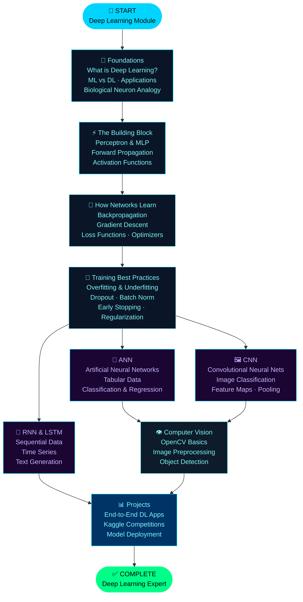

---

## 🧩 Architecture Deep Dive

### 🤖 Part 1 — Artificial Neural Network (ANN)

> Best for: **Tabular / Structured Data** — classification & regression problems

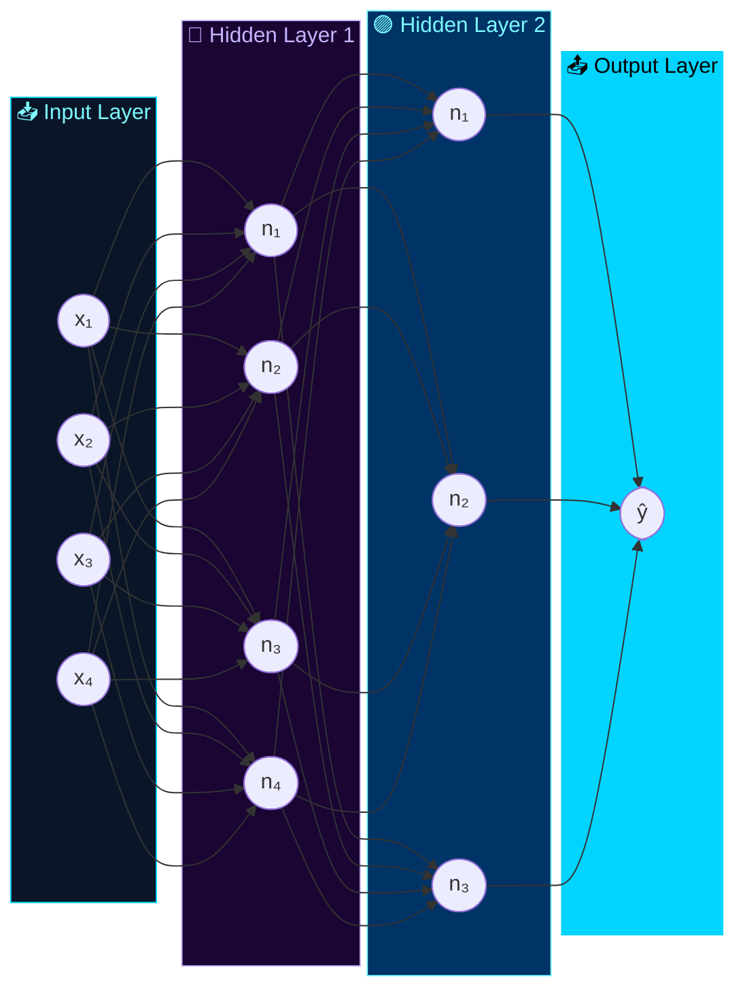

| 🔑 Concept | 📋 Description | Notebook |
|-----------|---------------|:--------:|
| **Perceptron** | Single neuron — weighted sum + activation | `01_perceptron.ipynb` |
| **MLP** | Multi-Layer Perceptron — stacked dense layers | `02_ann_basics.ipynb` |
| **Forward Pass** | Input → Hidden → Output (predictions) | `02_ann_basics.ipynb` |
| **Backpropagation** | Compute gradients, update weights via chain rule | `03_backprop.ipynb` |
| **Loss Functions** | MSE (regression) · Binary/Categorical CE (classification) | `03_backprop.ipynb` |
| **Optimizers** | SGD · Adam · RMSprop — update weights to minimize loss | `04_optimizers.ipynb` |
| **ANN Project** | Customer churn prediction · House price prediction | `05_ann_project.ipynb` |

---

### 🖼️ Part 2 — Convolutional Neural Network (CNN)

> Best for: **Images & Visual Data** — classification, detection, segmentation

```mermaid
flowchart LR
    IMG(["🖼️ Input Image\n32×32×3"]) -->|"Conv2D\n+ReLU"| C1["Feature Maps\n30×30×32"]
    C1 -->|"MaxPooling\n2×2"| P1["15×15×32"]
    P1 -->|"Conv2D\n+ReLU"| C2["13×13×64"]
    C2 -->|"MaxPooling\n2×2"| P2["6×6×64"]
    P2 -->|"Flatten"| FL["2304 units"]
    FL -->|"Dense\n+ReLU"| D1["128 units"]
    D1 -->|"Dropout\n0.5"| DR["128 units"]
    DR -->|"Dense\n+Softmax"| OUT(["📤 Predictions\n10 classes"])

    style IMG fill:#0a1628,stroke:#00D4FF,color:#7DF9FF
    style C1  fill:#1a0533,stroke:#c4b5fd,color:#c4b5fd
    style P1  fill:#003366,stroke:#7DF9FF,color:#7DF9FF
    style C2  fill:#1a0533,stroke:#c4b5fd,color:#c4b5fd
    style P2  fill:#003366,stroke:#7DF9FF,color:#7DF9FF
    style FL  fill:#0a1628,stroke:#00D4FF,color:#7DF9FF
    style D1  fill:#1a0533,stroke:#c4b5fd,color:#c4b5fd
    style DR  fill:#003366,stroke:#7DF9FF,color:#7DF9FF
    style OUT fill:#00D4FF,stroke:none,color:#000
```

| 🔑 Concept | 📋 Description | Notebook |
|-----------|---------------|:--------:|
| **Convolution** | Filter slides over image to extract spatial features | `06_cnn_basics.ipynb` |
| **Feature Maps** | Output of applying a convolutional filter | `06_cnn_basics.ipynb` |
| **Pooling** | MaxPool/AvgPool — reduce spatial dimensions | `06_cnn_basics.ipynb` |
| **Padding** | `same` or `valid` — controls output size | `06_cnn_basics.ipynb` |
| **Stride** | Step size of the sliding filter | `06_cnn_basics.ipynb` |
| **Flatten + Dense** | Convert feature maps to 1D → classification head | `07_cnn_project.ipynb` |
| **Data Augmentation** | Flip, rotate, zoom — fight overfitting | `07_cnn_project.ipynb` |
| **Transfer Learning** | VGG16, ResNet, MobileNet — use pretrained weights | `08_transfer_learning.ipynb` |
| **CNN Project** | CIFAR-10 · MNIST Digit Classifier · Cats vs Dogs | `07_cnn_project.ipynb` |

---

### 🔁 Part 3 — Recurrent Neural Network (RNN) & LSTM

> Best for: **Sequential / Time-Series Data** — NLP, forecasting, stock prices

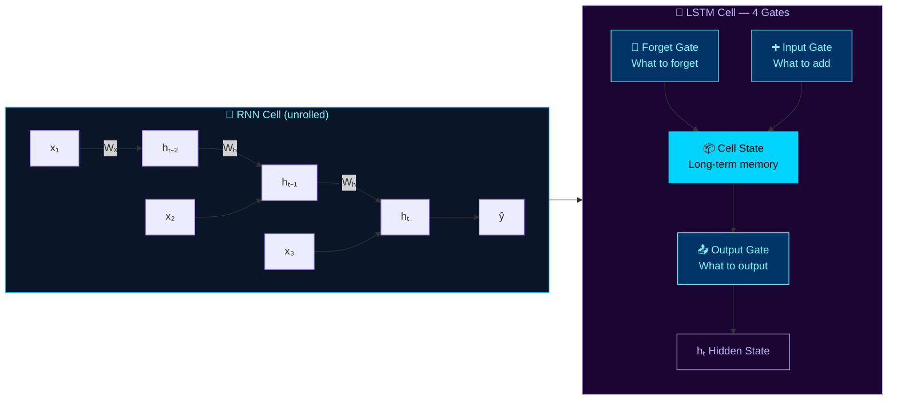

| 🔑 Concept | 📋 Description | Notebook |
|-----------|---------------|:--------:|
| **Vanilla RNN** | Processes sequences step-by-step with hidden state | `09_rnn_basics.ipynb` |
| **Vanishing Gradient** | RNNs struggle with long sequences — gradients shrink | `09_rnn_basics.ipynb` |
| **LSTM** | Long Short-Term Memory — solves vanishing gradient | `10_lstm.ipynb` |
| **Forget Gate** | Decides what info to discard from cell state | `10_lstm.ipynb` |
| **Input Gate** | Decides what new info to store in cell state | `10_lstm.ipynb` |
| **Output Gate** | Decides what part of cell state to output | `10_lstm.ipynb` |
| **GRU** | Gated Recurrent Unit — simplified, faster than LSTM | `10_lstm.ipynb` |
| **RNN/LSTM Project** | Stock price prediction · Sentiment analysis · Text gen | `11_rnn_project.ipynb` |

---

### 👁️ Part 4 — Computer Vision with OpenCV

| 🔑 Concept | 📋 Description | Notebook |
|-----------|---------------|:--------:|
| **Image Reading** | `cv2.imread()` · Channels (BGR vs RGB) | `12_opencv_basics.ipynb` |
| **Image Preprocessing** | Resize · Normalize · Grayscale conversion | `12_opencv_basics.ipynb` |
| **Image Operations** | Blur · Edge detection · Thresholding | `12_opencv_basics.ipynb` |
| **Object Detection** | Haar Cascades · YOLO integration concepts | `12_opencv_basics.ipynb` |
| **Video Processing** | Reading frames from webcam / video files | `12_opencv_basics.ipynb` |

---

## 📊 Coverage Charts

### Topic Distribution

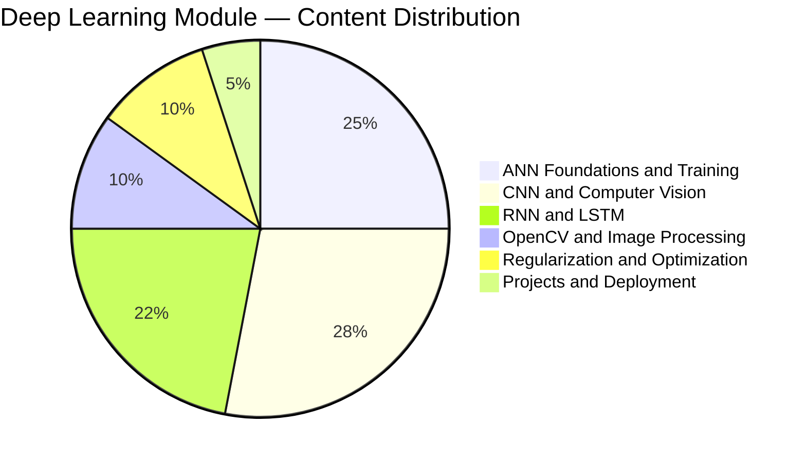

### Study Hours Per Topic

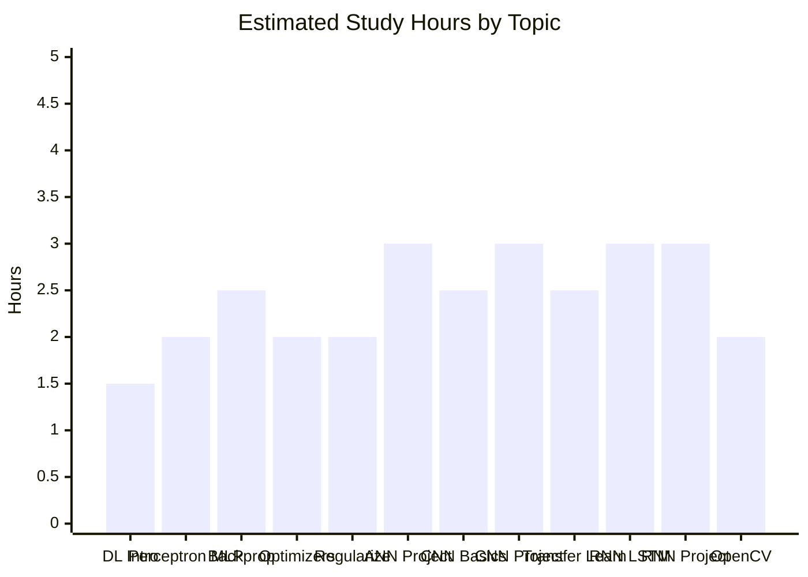

### Module Timeline in Full Course

```mermaid
gantt
    title Deep Learning Position in WsCube Tech DS Course
    dateFormat  X
    axisFormat  Week %s

    section Foundations
    Python and Stats         :done,    f1, 1, 5
    NumPy and Pandas         :done,    f2, 5, 9

    section Visualization
    Matplotlib and EDA       :done,    v1, 9, 13

    section Machine Learning
    Supervised ML            :done,    ml1, 13, 18
    Unsupervised ML          :done,    ml2, 18, 21

    section Deep Learning
    ANN Foundations          :active,  dl1, 21, 23
    CNN and Computer Vision  :active,  dl2, 23, 25
    RNN and LSTM             :         dl3, 25, 27

    section Capstone
    Projects and Deployment  :         cp1, 27, 29
```

---

## ⚡ Activation Functions Cheatsheet

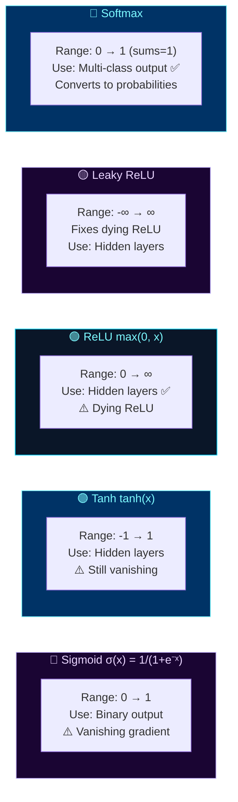

| Function | Formula | Range | Best Used For | Layer Type |
|----------|---------|-------|--------------|------------|
| **Sigmoid** | `1 / (1 + e⁻ˣ)` | (0, 1) | Binary classification output | Output |
| **Tanh** | `(eˣ − e⁻ˣ)/(eˣ + e⁻ˣ)` | (-1, 1) | RNN hidden states | Hidden |
| **ReLU** | `max(0, x)` | [0, ∞) | Most hidden layers ✅ Most popular | Hidden |
| **Leaky ReLU** | `max(0.01x, x)` | (-∞, ∞) | When dying ReLU is an issue | Hidden |
| **ELU** | `x if x>0 else α(eˣ−1)` | (-α, ∞) | Smoother than ReLU | Hidden |
| **Softmax** | `eˣⁱ / Σeˣʲ` | (0, 1) | Multi-class output ✅ | Output |

---

## 🎛️ Optimizers Guide

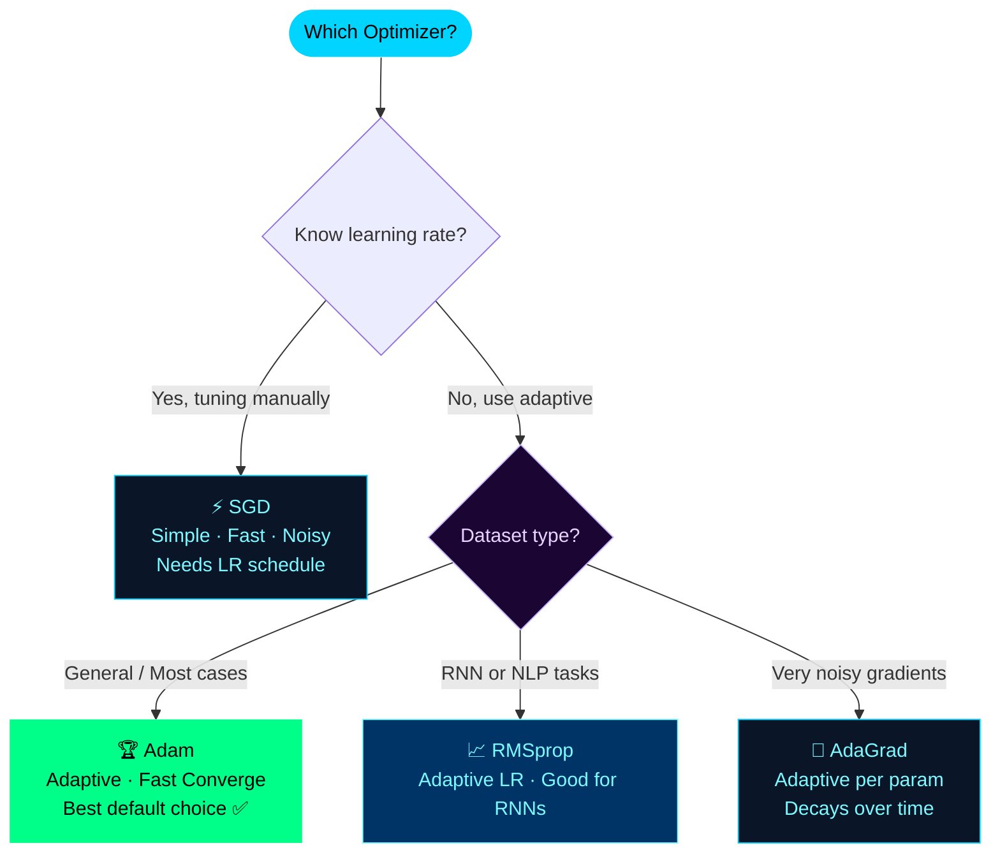

| Optimizer | Best For | Key Params | Keras Usage |
|-----------|---------|-----------|-------------|
| **SGD** | Simple tasks, custom LR schedules | `lr`, `momentum` | `optimizer='sgd'` |
| **Adam** ⭐ | Most tasks — best default | `lr=0.001`, `beta_1`, `beta_2` | `optimizer='adam'` |
| **RMSprop** | RNNs and sequential models | `lr`, `rho` | `optimizer='rmsprop'` |
| **AdaGrad** | Sparse data / NLP | `lr` | `optimizer='adagrad'` |
| **AdamW** | Regularized training | `lr`, `weight_decay` | `tf.keras.optimizers.AdamW` |

---

## 🏗️ Which Architecture to Use?

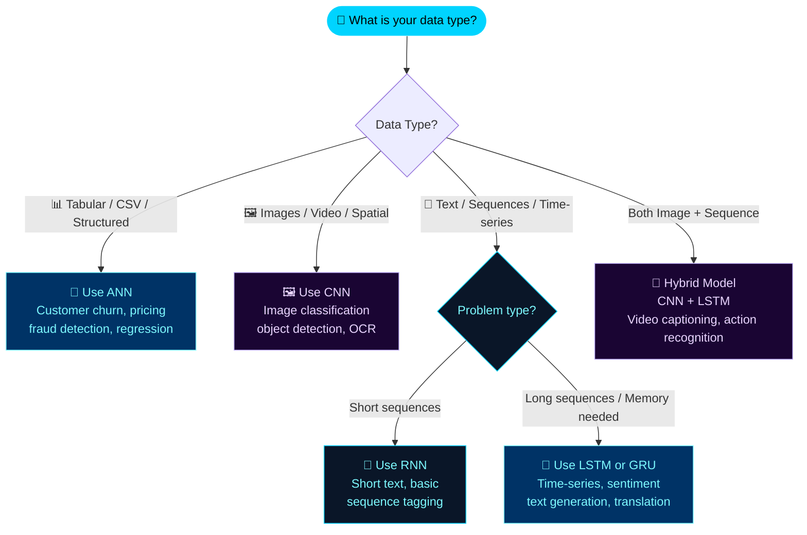

### Architecture Comparison Table

| Feature | 🤖 ANN | 🖼️ CNN | 🔁 RNN | 🧠 LSTM |
|---------|:------:|:------:|:------:|:-------:|
| **Data Type** | Tabular | Images | Sequences | Long Sequences |
| **Spatial Awareness** | ❌ | ✅ | ❌ | ❌ |
| **Sequential Memory** | ❌ | ❌ | ✅ (short) | ✅ (long) |
| **Translation Invariance** | ❌ | ✅ | ❌ | ❌ |
| **Vanishing Gradient** | Moderate | Low | High ⚠️ | Solved ✅ |
| **Computational Cost** | Low | High | Medium | High |
| **Typical Use** | Churn, Pricing | Vision, OCR | Basic NLP | Time-series, NLP |
| **Keras Layer** | `Dense` | `Conv2D` | `SimpleRNN` | `LSTM` |

---

## 📐 Key Concepts & Glossary

<div align="center">

| 📌 Term | 💡 Definition |
|--------|--------------|
| **Epoch** | One full pass of the training data through the model |
| **Batch Size** | Number of samples processed before updating weights |
| **Learning Rate** | Step size for weight updates — too high=diverge, too low=slow |
| **Overfitting** | Model memorizes training data, fails on new data |
| **Underfitting** | Model is too simple to capture patterns |
| **Dropout** | Randomly zeros neurons during training — prevents overfitting |
| **Batch Normalization** | Normalizes layer inputs — stabilizes & speeds up training |
| **Weight Initialization** | How weights are set at start — He, Xavier, Random |
| **Gradient Descent** | Optimization algorithm — move weights in direction of steepest descent |
| **Vanishing Gradient** | Gradients become tiny in deep networks — weights stop updating |
| **Transfer Learning** | Use pretrained model weights as starting point |
| **Fine-Tuning** | Unfreeze pretrained layers and train on new data |
| **Confusion Matrix** | True Positive/Negative, False Positive/Negative — classification evaluation |
| **ROC-AUC** | Area Under Curve — how well model separates classes |

</div>

---

## 🔬 Layer Types Reference

| Layer | Keras API | Purpose | Used In |
|-------|-----------|---------|---------|
| **Dense** | `layers.Dense(units, activation)` | Fully connected — any problem | ANN, CNN head |
| **Conv2D** | `layers.Conv2D(filters, kernel_size)` | 2D spatial convolution | CNN |
| **MaxPooling2D** | `layers.MaxPooling2D(pool_size)` | Spatial downsampling | CNN |
| **Flatten** | `layers.Flatten()` | Convert 2D feature maps to 1D | CNN → Dense |
| **SimpleRNN** | `layers.SimpleRNN(units)` | Vanilla recurrent layer | Sequences |
| **LSTM** | `layers.LSTM(units, return_sequences)` | Long-short term memory | NLP, time-series |
| **GRU** | `layers.GRU(units)` | Gated recurrent, lighter than LSTM | NLP, time-series |
| **Embedding** | `layers.Embedding(vocab_size, dim)` | Text → dense vectors | NLP |
| **Dropout** | `layers.Dropout(rate)` | Regularization — zero out neurons | All models |
| **BatchNorm** | `layers.BatchNormalization()` | Normalize layer activations | All models |
| **GlobalAvgPool2D** | `layers.GlobalAveragePooling2D()` | Aggregate spatial features | CNN head |

---

## 📁 Folder Structure

```
📂 DEEP LEARNING/
│
├── 📓 01_intro_to_deep_learning.ipynb
│   └── → ML vs DL · Biological neurons · Applications · Frameworks
│
├── 📓 02_ann_perceptron_mlp.ipynb
│   └── → Perceptron · MLP · Forward pass · Architecture
│
├── 📓 03_backpropagation_loss.ipynb
│   └── → Chain rule · Gradient descent · MSE · Cross-entropy
│
├── 📓 04_activation_functions.ipynb
│   └── → ReLU · Sigmoid · Tanh · Softmax · Leaky ReLU
│
├── 📓 05_optimizers_training.ipynb
│   └── → SGD · Adam · RMSprop · LR schedules · Early stopping
│
├── 📓 06_regularization.ipynb
│   └── → Dropout · Batch normalization · L1/L2 · Overfitting fix
│
├── 📓 07_ann_project_churn.ipynb
│   └── → Telecom churn prediction end-to-end
│
├── 📓 08_cnn_basics.ipynb
│   └── → Conv2D · MaxPooling · Feature maps · Padding · Stride
│
├── 📓 09_cnn_project_image_classification.ipynb
│   └── → MNIST / CIFAR-10 · Data augmentation · Training pipeline
│
├── 📓 10_transfer_learning.ipynb
│   └── → VGG16 · ResNet50 · MobileNet · Fine-tuning
│
├── 📓 11_rnn_basics.ipynb
│   └── → Vanilla RNN · Vanishing gradient · Sequence modeling
│
├── 📓 12_lstm_gru.ipynb
│   └── → LSTM gates · GRU · Return sequences · Stacked LSTM
│
├── 📓 13_rnn_project_stock_prediction.ipynb
│   └── → Time-series forecasting with LSTM
│
├── 📓 14_opencv_basics.ipynb
│   └── → cv2.imread · Resize · Grayscale · Edge detection
│
└── 📄 README.md
```

---

## 🛠️ Tools & Libraries

<div align="center">

| 📦 Library | 🎯 Role | 💡 Key APIs |
|-----------|--------|------------|
|  | Core DL framework by Google | `tf.keras`, `tf.data`, `tf.GradientTape` |
|  | High-level NN API (inside TF) | `Sequential`, `Model`, `layers.*` |
|  | Array ops & data prep | `np.array`, `reshape`, `expand_dims` |
|  | Load & preprocess datasets | `read_csv`, `get_dummies`, `fillna` |
|  | Training curve plots | `plt.plot(history.history['loss'])` |
|  | Computer vision ops | `cv2.imread`, `cv2.resize`, `cv2.cvtColor` |
|  | Preprocessing & evaluation | `StandardScaler`, `train_test_split`, `classification_report` |

</div>

---

## 💻 Quick Code Reference

### ⚡ Build & Train an ANN (Keras)

```python
import tensorflow as tf
from tensorflow.keras import layers, Sequential

# Build model
model = Sequential([
    layers.Dense(128, activation='relu', input_shape=(X_train.shape[1],)),
    layers.BatchNormalization(),
    layers.Dropout(0.3),
    layers.Dense(64, activation='relu'),
    layers.Dropout(0.2),
    layers.Dense(1, activation='sigmoid')   # Binary classification
])

# Compile
model.compile(optimizer='adam',
              loss='binary_crossentropy',
              metrics=['accuracy'])

# Train with early stopping
early_stop = tf.keras.callbacks.EarlyStopping(patience=10, restore_best_weights=True)
history = model.fit(X_train, y_train,
                    epochs=100,
                    batch_size=32,
                    validation_split=0.2,
                    callbacks=[early_stop])
```

### 🖼️ Build a CNN for Image Classification

```python
model = Sequential([
    layers.Conv2D(32, (3,3), activation='relu', input_shape=(64, 64, 3)),
    layers.MaxPooling2D(2, 2),
    layers.Conv2D(64, (3,3), activation='relu'),
    layers.MaxPooling2D(2, 2),
    layers.Conv2D(128, (3,3), activation='relu'),
    layers.Flatten(),
    layers.Dense(128, activation='relu'),
    layers.Dropout(0.5),
    layers.Dense(10, activation='softmax')  # 10 classes
])

model.compile(optimizer='adam',
              loss='sparse_categorical_crossentropy',
              metrics=['accuracy'])
```

### 🔁 Build an LSTM for Time-Series

```python
model = Sequential([
    layers.LSTM(64, return_sequences=True, input_shape=(timesteps, features)),
    layers.Dropout(0.2),
    layers.LSTM(32, return_sequences=False),
    layers.Dropout(0.2),
    layers.Dense(1)   # Regression output (next value)
])

model.compile(optimizer='adam', loss='mse')
```

---

## 🚀 Getting Started

### 1️⃣ Clone & Navigate

```bash
git clone https://github.com/MuhammadZafran33/Data-Science-Course.git
cd "Data-Science-Course/Data Science Full Course By WsCube Tech/DEEP LEARNING"
```

### 2️⃣ Install Dependencies

```bash
pip install tensorflow keras numpy pandas matplotlib seaborn opencv-python scikit-learn jupyter
```

### 3️⃣ Launch Notebooks

```bash
jupyter notebook
```

> ☁️ **No GPU locally? Run free on Google Colab with GPU runtime:**

<div align="center">

[](https://colab.research.google.com/github/MuhammadZafran33/Data-Science-Course/)

</div>

### ✅ Recommended Study Order

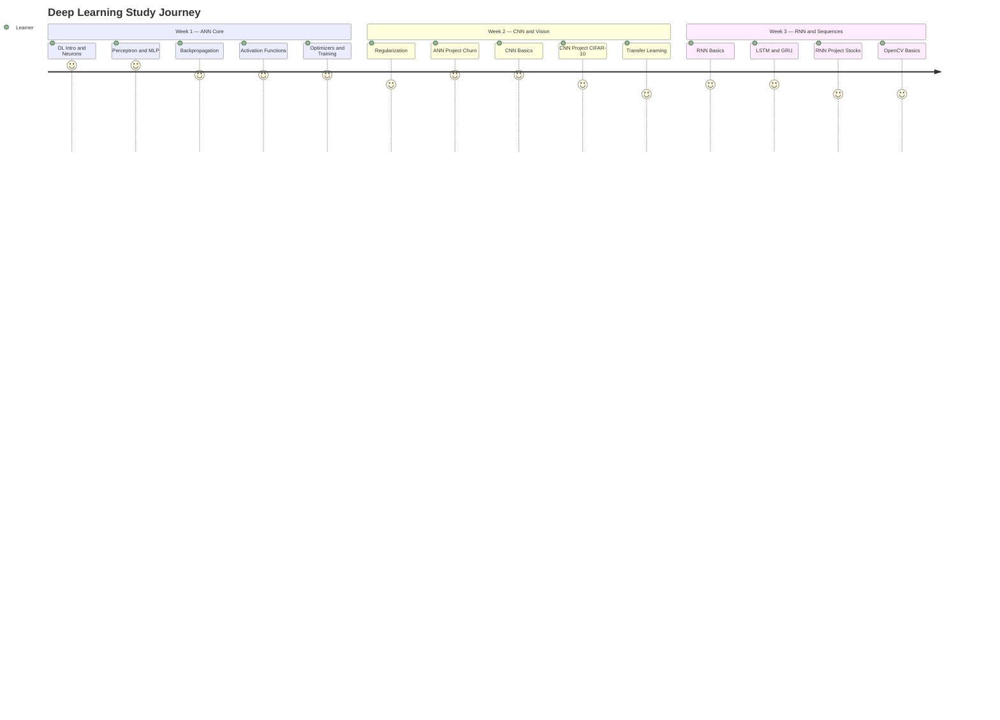

---

## 🔗 Navigation

<div align="center">

| ⬅️ Previous Module | 📍 You Are Here | ➡️ Next Module |
|-------------------|----------------|---------------|
| [🤖 Machine Learning](../MACHINE%20LEARNING/) | **🧠 Deep Learning** | [💬 NLP / Text Mining →](../NLP/) |

</div>

---

<div align="center">

<br/>

[](https://github.com/MuhammadZafran33)


> *"The brain is the last and grandest biological frontier, the most complex thing we have yet discovered in our universe."*
> **— James D. Watson**

<br/>

**⭐ If this helped your Deep Learning journey — drop a star! ⭐**

<br/>

<!-- FOOTER TYPING ANIMATION -->


</div>
