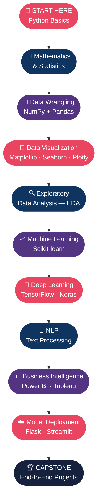
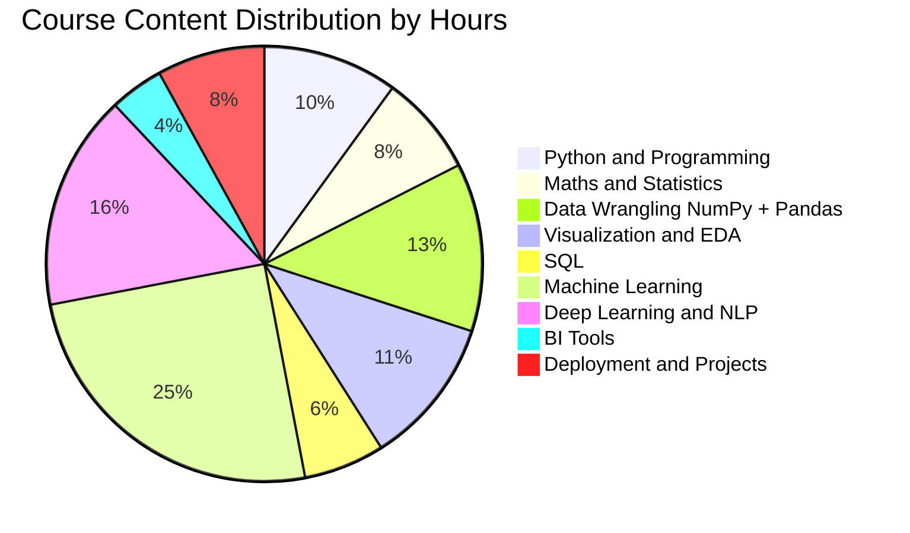
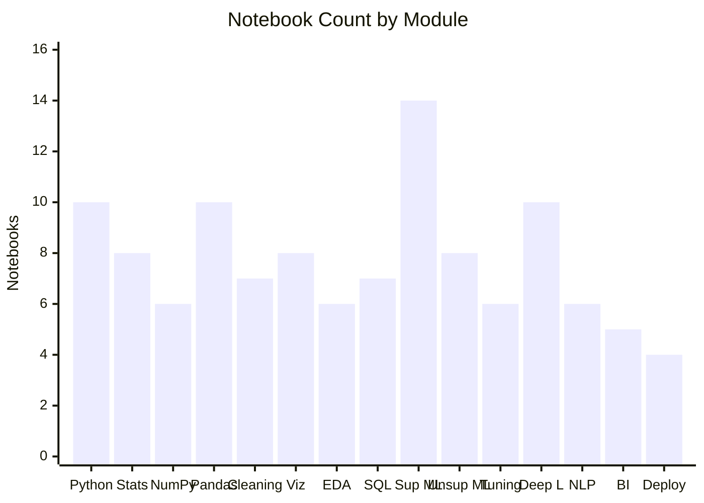
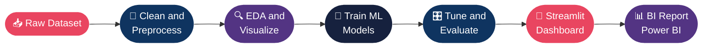
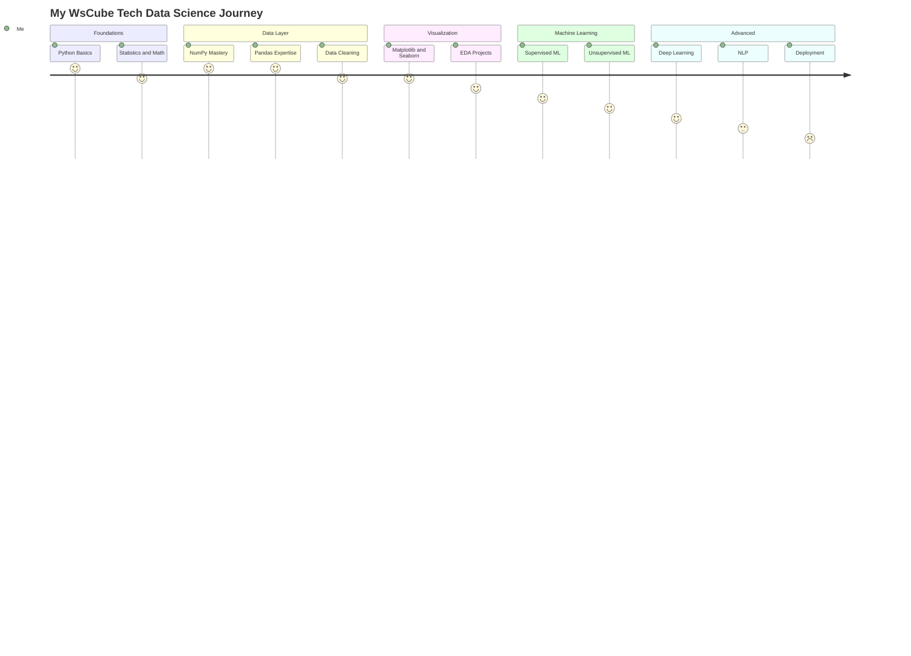

<div align="center">

<!-- ANIMATED WAVE HEADER -->


<br/>

<!-- BADGE ROW 1 — PLATFORM & TOOLS -->
<p>
  
  
  
  
  
</p>

<!-- BADGE ROW 2 — EXTENDED TOOLS -->
<p>
  
  
  
  
  
</p>

<!-- BADGE ROW 3 — REPO META -->
<p>
  
  
  
  
  
</p>

<br/>

> ### 📌 My personal learning journey following the **WsCube Tech Data Science Full Course**
> *This folder contains all notebooks, practice files, assignments & projects completed while studying the course.*

<br/>

</div>

---

## 📚 Table of Contents

| Section | Link |
|---------|------|
| 🎯 About This Folder | [Jump](#-about-this-folder) |
| 🗺️ Full Course Roadmap | [Jump](#️-full-course-roadmap) |
| 📦 Module Breakdown | [Jump](#-module-breakdown) |
| 📊 Topics Coverage Chart | [Jump](#-topics-coverage-chart) |
| 🛠️ Tools & Technologies | [Jump](#️-tools--technologies) |
| 🔄 Data Science Lifecycle | [Jump](#-data-science-lifecycle) |
| 📁 Folder Structure | [Jump](#-folder-structure) |
| 🏆 Projects & Assignments | [Jump](#-projects--assignments) |
| 🚀 How to Use This Repo | [Jump](#-how-to-use-this-repo) |
| 📬 Connect with Me | [Jump](#-connect-with-me) |

---

## 🎯 About This Folder

This directory is a **complete collection of my hands-on work** from the [WsCube Tech Data Science Full Course](https://www.wscubetech.com/data-science-course) — one of India's most comprehensive data science programs.

<div align="center">

| 📌 Attribute | 📋 Details |
|-------------|-----------|
| 🎓 **Course** | Data Science & AI Full Course by WsCube Tech |
| 🏫 **Provider** | [WsCube Tech](https://www.wscubetech.com) |
| ⏱️ **Duration** | 28 Weeks (200+ Hours of Content) |
| 🧑‍💻 **Level** | Beginner → Advanced |
| 📓 **Format** | Live Classes + Jupyter Notebooks + Projects |
| 🏆 **Certificate** | WsCube Tech Certificate of Completion |
| 💼 **Career Outcomes** | Data Scientist · ML Engineer · Data Analyst · AI Developer |

</div>

---

## 🗺️ Full Course Roadmap



---

## 📦 Module Breakdown

### ⏳ Course Timeline

```mermaid
gantt
    title WsCube Tech — Data Science Full Course Timeline
    dateFormat  X
    axisFormat  Week %s

    section Foundations
    Python Programming            :done,    p1, 1, 3
    Mathematics and Statistics    :done,    p2, 3, 5

    section Data Layer
    NumPy and Pandas              :done,    d1, 5, 7
    Data Cleaning and Preprocessing :done,  d2, 7, 9

    section Visualization
    Matplotlib and Seaborn        :active,  v1, 9, 11
    Plotly and Interactive Viz    :active,  v2, 11, 12

    section Analysis
    Exploratory Data Analysis     :         e1, 12, 14
    SQL for Data Science          :         e2, 14, 16

    section Machine Learning
    Supervised Learning           :         m1, 16, 19
    Unsupervised Learning         :         m2, 19, 21
    Model Evaluation and Tuning   :         m3, 21, 23

    section Advanced
    Deep Learning with Keras      :         a1, 23, 25
    NLP Fundamentals              :         a2, 25, 26

    section Production
    Power BI and Tableau          :         pr1, 26, 27
    Deployment and Capstone       :         pr2, 27, 29
```



### 📋 Detailed Module Table

| # | 📚 Module | 🔑 Key Topics | 📓 Notebooks | ⏱️ Hours | 🎯 Level |
|---|-----------|--------------|:---:|:---:|---------|
| `01` | 🐍 **Python for Data Science** | Variables, loops, functions, OOP, file I/O, libraries | 10 | 20h | `⭐ Beginner` |
| `02` | 🔢 **Maths & Statistics** | Probability, distributions, hypothesis testing, linear algebra | 8 | 15h | `⭐ Beginner` |
| `03` | 🔢 **NumPy** | N-dimensional arrays, broadcasting, vectorization, math ops | 6 | 10h | `⭐⭐ Easy` |
| `04` | 🐼 **Pandas** | DataFrames, groupby, merge, pivot, time series | 10 | 15h | `⭐⭐ Easy` |
| `05` | 🧹 **Data Cleaning** | Missing values, outliers, encoding, feature engineering | 7 | 12h | `⭐⭐ Easy` |
| `06` | 🎨 **Data Visualization** | Matplotlib, Seaborn, Plotly, storytelling with data | 8 | 12h | `⭐⭐ Easy` |
| `07` | 🔍 **EDA** | Univariate, bivariate, multivariate analysis, real datasets | 6 | 10h | `⭐⭐⭐ Medium` |
| `08` | 🗄️ **SQL for Data Science** | SELECT, JOINs, subqueries, window functions, CTE | 7 | 12h | `⭐⭐⭐ Medium` |
| `09` | 🤖 **Supervised ML** | Regression, classification, SVM, decision trees, ensemble | 14 | 25h | `⭐⭐⭐ Medium` |
| `10` | 🌀 **Unsupervised ML** | K-Means, DBSCAN, hierarchical clustering, PCA | 8 | 15h | `⭐⭐⭐ Medium` |
| `11` | 🎛️ **Model Tuning** | Cross-validation, GridSearch, pipelines, metrics | 6 | 10h | `⭐⭐⭐⭐ Hard` |
| `12` | 🧠 **Deep Learning** | ANN, CNN, RNN, LSTM with TensorFlow/Keras | 10 | 20h | `⭐⭐⭐⭐ Hard` |
| `13` | 💬 **NLP** | Tokenization, TF-IDF, Word2Vec, sentiment analysis | 6 | 12h | `⭐⭐⭐⭐ Hard` |
| `14` | 📊 **Power BI & Tableau** | Dashboards, KPI tracking, drill-through, DAX basics | 5 | 8h | `⭐⭐⭐ Medium` |
| `15` | 🚀 **Deployment** | Flask APIs, Streamlit dashboards, cloud basics | 4 | 8h | `⭐⭐⭐⭐⭐ Expert` |

---

## 📊 Topics Coverage Chart



### 📈 Notebooks Per Module



---

## 🛠️ Tools & Technologies

<div align="center">

| 🗂️ Category | 🛠️ Tools & Libraries |
|------------|----------------------|
| **Language** |  |
| **IDE / Notebooks** |    |
| **Data** |   |
| **Visualization** |    |
| **Machine Learning** |  |
| **Deep Learning** |   |
| **Database** |   |
| **BI Tools** |   |
| **Deployment** |   |
| **Version Control** |   |

</div>

---

## 🔄 Data Science Lifecycle

```mermaid
flowchart LR
    subgraph COLLECT ["📥 COLLECT"]
        A1[Raw Data\nAPIs · CSV · SQL\nWeb Scraping]
    end
    subgraph PREPARE ["🧹 PREPARE"]
        B1[Clean\nHandle Nulls] --> B2[Transform\nEncode · Scale] --> B3[Feature\nEngineering]
    end
    subgraph ANALYZE ["🔍 ANALYZE"]
        C1[EDA\nStatistics] --> C2[Visualize\nPatterns]
    end
    subgraph MODEL ["🤖 MODEL"]
        D1[Train\nML Models] --> D2[Evaluate\nMetrics] --> D3[Tune\nHyperparams]
    end
    subgraph DEPLOY ["🚀 DEPLOY"]
        E1[API\nFlask] --> E2[Dashboard\nStreamlit]
    end

    A1 --> B1
    B3 --> C1
    C2 --> D1
    D3 --> E1

    style A1 fill:#e94560,stroke:none,color:#fff
    style B1 fill:#0f3460,stroke:none,color:#fff
    style B2 fill:#0f3460,stroke:none,color:#fff
    style B3 fill:#0f3460,stroke:none,color:#fff
    style C1 fill:#533483,stroke:none,color:#fff
    style C2 fill:#533483,stroke:none,color:#fff
    style D1 fill:#16213e,stroke:none,color:#fff
    style D2 fill:#16213e,stroke:none,color:#fff
    style D3 fill:#16213e,stroke:none,color:#fff
    style E1 fill:#e94560,stroke:none,color:#fff
    style E2 fill:#e94560,stroke:none,color:#fff
```



---

## 📁 Folder Structure

```
📦 Data Science Full Course By WsCube Tech/
│
├── 📂 01_Python_For_Data_Science/
│   ├── 📓 01_basics_variables_datatypes.ipynb
│   ├── 📓 02_loops_conditions_functions.ipynb
│   ├── 📓 03_oops_in_python.ipynb
│   └── 📓 04_python_for_ds_libraries.ipynb
│
├── 📂 02_Mathematics_And_Statistics/
│   ├── 📓 01_probability_fundamentals.ipynb
│   ├── 📓 02_distributions_normal_binomial.ipynb
│   ├── 📓 03_hypothesis_testing.ipynb
│   └── 📓 04_linear_algebra_basics.ipynb
│
├── 📂 03_NumPy/
│   ├── 📓 01_arrays_indexing_slicing.ipynb
│   ├── 📓 02_broadcasting_operations.ipynb
│   └── 📓 03_linear_algebra_numpy.ipynb
│
├── 📂 04_Pandas/
│   ├── 📓 01_series_and_dataframes.ipynb
│   ├── 📓 02_data_selection_filtering.ipynb
│   ├── 📓 03_groupby_aggregation.ipynb
│   ├── 📓 04_merging_joining.ipynb
│   └── 📓 05_time_series_pandas.ipynb
│
├── 📂 05_Data_Cleaning/
│   ├── 📓 01_handling_missing_values.ipynb
│   ├── 📓 02_outlier_detection.ipynb
│   └── 📓 03_encoding_scaling.ipynb
│
├── 📂 06_Data_Visualization/
│   ├── 📓 01_matplotlib_complete.ipynb
│   ├── 📓 02_seaborn_plots.ipynb
│   └── 📓 03_plotly_interactive.ipynb
│
├── 📂 07_EDA_Projects/
│   ├── 📁 EDA_01_Titanic_Dataset/
│   ├── 📁 EDA_02_IPL_Analysis/
│   └── 📁 EDA_03_COVID_Data/
│
├── 📂 08_SQL_For_Data_Science/
│   ├── 📓 01_select_where_orderby.ipynb
│   ├── 📓 02_joins_subqueries.ipynb
│   └── 📓 03_window_functions_cte.ipynb
│
├── 📂 09_Machine_Learning/
│   ├── 📓 01_linear_regression.ipynb
│   ├── 📓 02_logistic_regression.ipynb
│   ├── 📓 03_decision_trees_random_forest.ipynb
│   ├── 📓 04_svm_knn_naive_bayes.ipynb
│   ├── 📓 05_kmeans_pca.ipynb
│   └── 📓 06_model_evaluation_tuning.ipynb
│
├── 📂 10_Deep_Learning/
│   ├── 📓 01_ann_with_keras.ipynb
│   ├── 📓 02_cnn_image_classification.ipynb
│   └── 📓 03_rnn_lstm_sequences.ipynb
│
├── 📂 11_NLP/
│   ├── 📓 01_text_preprocessing.ipynb
│   └── 📓 02_sentiment_analysis.ipynb
│
├── 📂 12_Projects/
│   ├── 📁 Project_01_House_Price_Prediction/
│   ├── 📁 Project_02_Customer_Churn/
│   └── 📁 Project_03_Capstone_End_to_End/
│
└── 📄 README.md
```

---

## 🏆 Projects & Assignments

### 🧪 EDA Projects

| # | 📁 Project | 📊 Dataset | 🔍 Analysis Type | 🛠️ Tools | Status |
|---|-----------|-----------|-----------------|---------|--------|
| 1 | **Titanic Survival Analysis** | Titanic (Kaggle) | Bivariate + Heatmaps | Pandas, Seaborn | ✅ Done |
| 2 | **IPL Cricket Analysis** | IPL Data 2008–2024 | Time-series + GroupBy | Plotly, Pandas | ✅ Done |
| 3 | **COVID-19 Dashboard** | Our World in Data | Geo + Trend Analysis | Plotly, Folium | 🚧 In Progress |

### 🤖 Machine Learning Projects

| # | 📁 Project | 🎯 Problem Type | 📊 Dataset | 🏆 Best Model | Status |
|---|-----------|----------------|-----------|--------------|--------|
| 1 | **House Price Prediction** | Regression | Ames Housing | XGBoost (R²=0.91) | ✅ Done |
| 2 | **Customer Churn Prediction** | Classification | Telecom Dataset | Random Forest (92%) | ✅ Done |
| 3 | **Mall Customer Segmentation** | Clustering | Mall Dataset | K-Means (k=5) | ✅ Done |
| 4 | **Spam Email Classifier** | NLP + Classification | Enron Email | Naive Bayes (97%) | 🚧 In Progress |

### 🏅 Capstone Project Pipeline



---

## 🚀 How to Use This Repo

### Step 1 — Clone the Repo

```bash
git clone https://github.com/MuhammadZafran33/Data-Science-Course.git
cd "Data-Science-Course/Data Science Full Course By WsCube Tech"
```

### Step 2 — Set Up Environment

```bash
# Create virtual environment
python -m venv ds-env

# Activate it
source ds-env/bin/activate          # macOS / Linux
ds-env\Scripts\activate             # Windows

# Install all dependencies
pip install -r requirements.txt
```

### Step 3 — Launch Notebooks

```bash
jupyter notebook
```

> 💡 **Prefer the cloud?** Open any notebook instantly in Google Colab — no local setup needed!

<div align="center">

[](https://colab.research.google.com/github/MuhammadZafran33/Data-Science-Course/)

</div>

### ⚙️ Core Requirements

```txt
numpy>=1.24          # Array computing
pandas>=2.0          # Data manipulation
matplotlib>=3.7      # Plotting
seaborn>=0.12        # Statistical viz
plotly>=5.14         # Interactive charts
scikit-learn>=1.3    # Machine Learning
tensorflow>=2.13     # Deep Learning
jupyter>=1.0         # Notebooks
sqlalchemy>=2.0      # SQL integration
streamlit>=1.25      # Web dashboards
flask>=2.3           # REST APIs
```

---

## 📈 My Learning Progress



---

## 🌟 Skills Progress Tracker

<div align="center">

| Skill | Progress |
|-------|----------|
| 🐍 Python | `████████████████████` 100% |
| 🔢 NumPy | `████████████████████` 95% |
| 🐼 Pandas | `████████████████████` 95% |
| 📉 Statistics | `██████████████░░░░░░` 70% |
| 🎨 Matplotlib & Seaborn | `████████████████░░░░` 80% |
| 🤖 Scikit-learn | `████████████░░░░░░░░` 60% |
| 🗄️ SQL | `████████████░░░░░░░░` 60% |
| 🧠 TensorFlow / Keras | `████████░░░░░░░░░░░░` 40% |
| 💬 NLP | `██████░░░░░░░░░░░░░░` 30% |
| 🚀 Deployment | `████░░░░░░░░░░░░░░░░` 20% |

</div>

---

## 📬 Connect with Me

<div align="center">

| Platform | Link |
|----------|------|
| 🐙 **GitHub** | [@MuhammadZafran33](https://github.com/MuhammadZafran33) |
| 💼 **LinkedIn** | [Connect with me](https://linkedin.com) |
| 📧 **Email** | Drop a message via GitHub Issues |

<br/>

[](https://github.com/MuhammadZafran33)

<br/>

> *"Without data you're just another person with an opinion."*
>
> **— W. Edwards Deming**

<br/>

**⭐ If this repo helped or inspired you, please give it a star — it keeps me motivated to keep learning and sharing! ⭐**

<br/>


</div>
