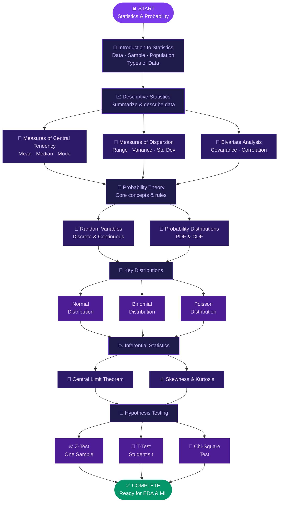
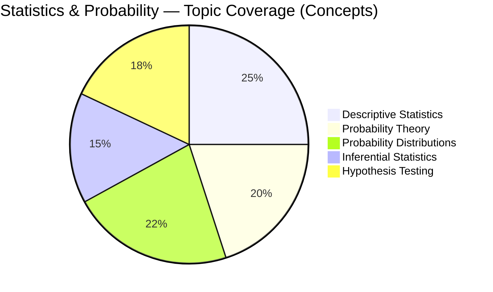
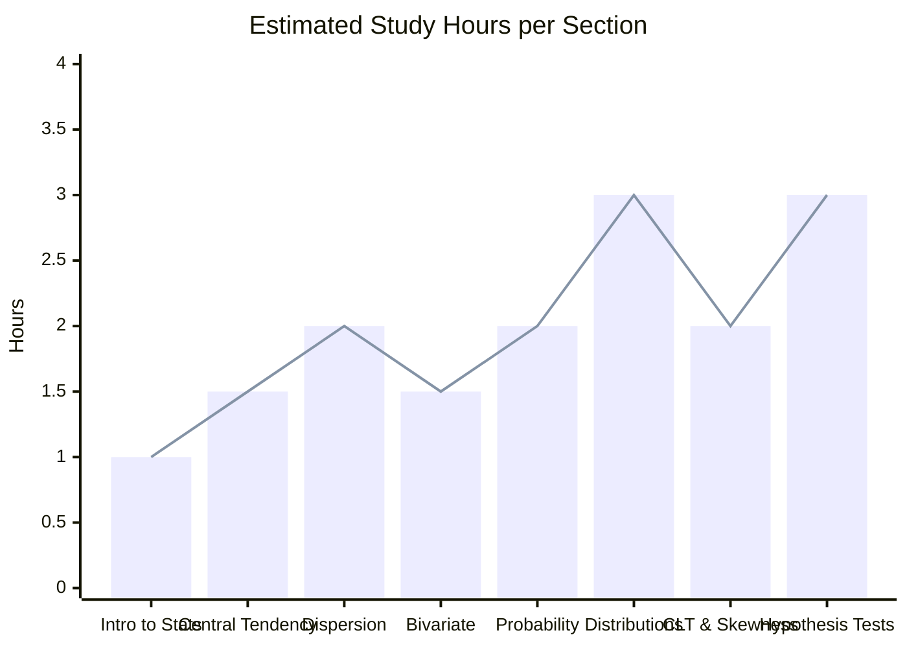
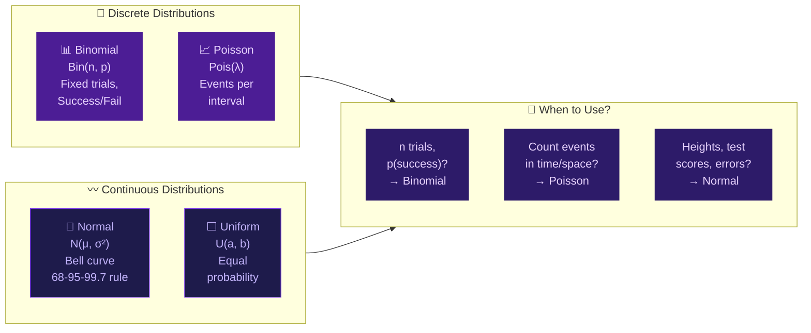
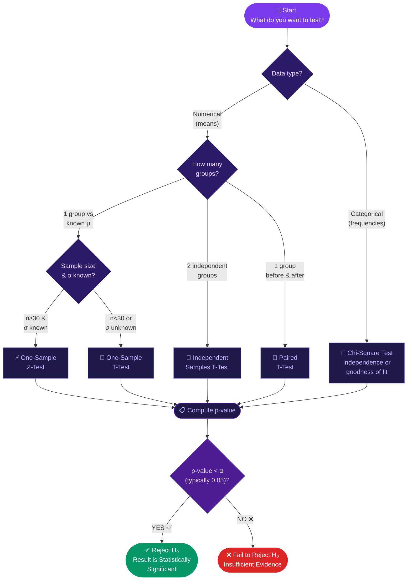
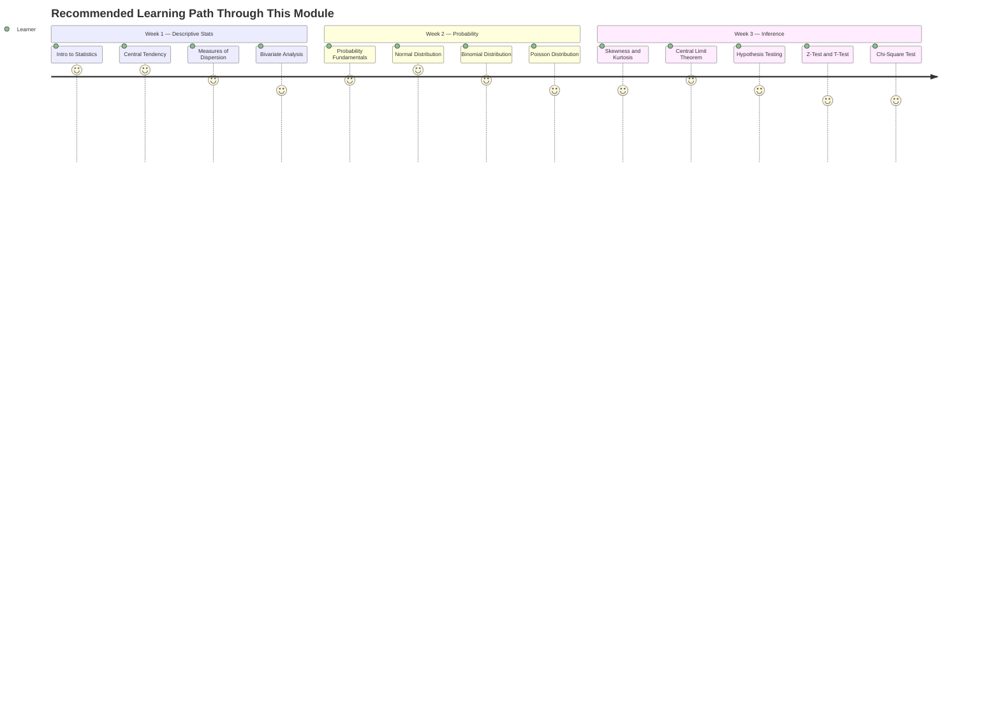
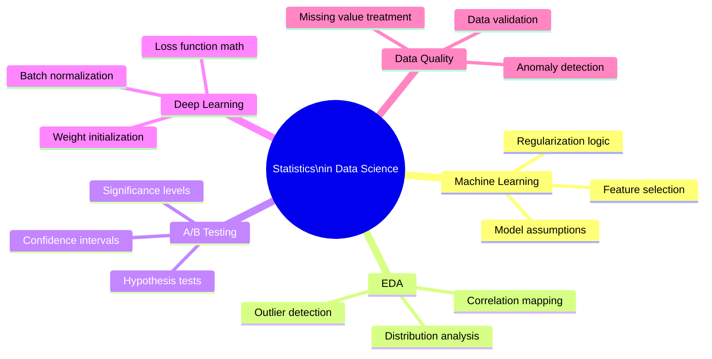

<div align="center">


<br/>

<p>
  
  
  
  
  
</p>

<p>
  
  
  
  
  
</p>

<br/>

> ### 🎯 *"Statistics is the grammar of science"* — Karl Pearson
>
> This module covers the complete **Statistics & Probability** foundation required for Data Science —
> from measures of central tendency all the way to hypothesis testing & probability distributions.

<br/>

</div>

---

## 📚 Table of Contents

| # | Section | Quick Link |
|---|---------|-----------|
| 01 | 🗺️ Module Overview | [Jump](#️-module-overview) |
| 02 | 🧭 Learning Roadmap | [Jump](#-learning-roadmap) |
| 03 | 📖 Topic Deep Dive | [Jump](#-topic-deep-dive) |
| 04 | 📊 Coverage Charts | [Jump](#-coverage-charts) |
| 05 | 🔬 Probability Distributions | [Jump](#-probability-distributions-at-a-glance) |
| 06 | 🧪 Hypothesis Testing Guide | [Jump](#-hypothesis-testing-decision-guide) |
| 07 | 📐 Key Formulas Cheatsheet | [Jump](#-key-formulas-cheatsheet) |
| 08 | 📁 Folder Structure | [Jump](#-folder-structure) |
| 09 | 🛠️ Tools & Libraries | [Jump](#️-tools--libraries) |
| 10 | 🚀 Getting Started | [Jump](#-getting-started) |

---

## 🗺️ Module Overview

<div align="center">

| 📌 Attribute | 📋 Details |
|-------------|-----------|
| 🎓 **Parent Course** | Data Science Full Course — WsCube Tech |
| 📂 **Module Name** | Statistics & Probability |
| 📍 **Position in Course** | Module 14–15 (Foundations before ML) |
| ⏱️ **Study Duration** | ~2–3 Weeks · 15+ Hours |
| 📓 **Notebooks** | 12+ Jupyter Notebooks |
| 🎯 **Why It Matters** | Every ML algorithm is built on statistical principles |
| 🔗 **Leads To** | EDA → Machine Learning → Model Evaluation |

</div>

---

## 🧭 Learning Roadmap



---

## 📖 Topic Deep Dive

### 🔷 PART 1 — Introduction to Statistics

| Topic | Description | Notebook |
|-------|-------------|:--------:|
| 📌 What is Statistics? | Definition, uses in data science & real-world examples | `01_intro_statistics.ipynb` |
| 👥 Data, Sample & Population | Difference between population parameters and sample statistics | `01_intro_statistics.ipynb` |
| 🏷️ Types of Data | Qualitative (nominal, ordinal) vs Quantitative (discrete, continuous) | `01_intro_statistics.ipynb` |

---

### 🔷 PART 2 — Descriptive Statistics

#### 📍 Measures of Central Tendency

| Measure | Formula | Best Used When | Notebook |
|---------|---------|---------------|:--------:|
| **Mean** | `Σx / n` | Symmetric data, no outliers | `02_central_tendency.ipynb` |
| **Median** | Middle value when sorted | Skewed data or outliers present | `02_central_tendency.ipynb` |
| **Mode** | Most frequent value | Categorical data | `02_central_tendency.ipynb` |

#### 📏 Measures of Dispersion

| Measure | Formula | What It Tells You | Notebook |
|---------|---------|------------------|:--------:|
| **Range** | `Max − Min` | Total spread of data | `03_dispersion.ipynb` |
| **Variance** | `Σ(x−μ)² / n` | Average squared deviation from mean | `03_dispersion.ipynb` |
| **Std Deviation** | `√Variance` | Spread in original units | `03_dispersion.ipynb` |
| **IQR** | `Q3 − Q1` | Middle 50% spread, robust to outliers | `03_dispersion.ipynb` |

#### 🔗 Bivariate Analysis

| Concept | Range | Interpretation | Notebook |
|---------|-------|---------------|:--------:|
| **Covariance** | `-∞ to +∞` | Direction of linear relationship | `04_bivariate.ipynb` |
| **Pearson Correlation** | `-1 to +1` | Strength + direction of relationship | `04_bivariate.ipynb` |

---

### 🔷 PART 3 — Probability & Distributions

#### 🎲 Probability Foundations

| Concept | Key Idea | Notebook |
|---------|---------|:--------:|
| **Random Variable** | Variable whose value is determined by a random experiment | `05_probability.ipynb` |
| **PDF** (Prob. Density Function) | Probability for continuous variables | `05_probability.ipynb` |
| **CDF** (Cumulative Distribution) | Probability that X ≤ x | `05_probability.ipynb` |
| **Normal Distribution** | Bell curve — the most important distribution in stats | `06_normal_dist.ipynb` |
| **Binomial Distribution** | Success/failure over n trials | `07_binomial_dist.ipynb` |
| **Poisson Distribution** | Count of events in a fixed interval | `08_poisson_dist.ipynb` |
| **Skewness** | Asymmetry of distribution around mean | `09_skewness.ipynb` |

---

### 🔷 PART 4 — Inferential Statistics & Hypothesis Testing

| Concept | Key Idea | Notebook |
|---------|---------|:--------:|
| **Central Limit Theorem** | Sample means are normally distributed regardless of population shape | `10_CLT.ipynb` |
| **Null Hypothesis (H₀)** | Default claim — no effect or difference exists | `11_hypothesis.ipynb` |
| **Alternate Hypothesis (H₁)** | What we aim to prove — effect or difference exists | `11_hypothesis.ipynb` |
| **p-value** | Probability of observing results if H₀ is true | `11_hypothesis.ipynb` |
| **Level of Significance (α)** | Threshold (typically 0.05) to reject H₀ | `11_hypothesis.ipynb` |
| **Confidence Interval** | Range that contains true parameter with (1−α)% certainty | `11_hypothesis.ipynb` |
| **One-Sample Z-Test** | Test population mean when σ is known, n ≥ 30 | `12_zttest.ipynb` |
| **Student's T-Test** | Test means when σ unknown or small sample | `12_zttest.ipynb` |
| **Chi-Square Test** | Test independence between categorical variables | `13_chi_square.ipynb` |

---

## 📊 Coverage Charts

### Content Distribution by Topic



### Time Investment Per Section



### Module Position in Full Course

```mermaid
gantt
    title Module 14-15 Position in WsCube Tech Data Science Course
    dateFormat  X
    axisFormat  Module %s

    section Core Python
    Python Fundamentals         :done,    m1,  1,  4
    Web Scraping                :done,    m2,  4,  5

    section Data Science Intro
    Intro to Data Science       :done,    m3,  5,  6
    Statistics and Probability  :active,  m4,  6,  8

    section Data Layer
    NumPy                       :         m5,  8,  9
    Pandas                      :         m6,  9, 11

    section Visualization
    Matplotlib and Seaborn      :         m7, 11, 13

    section Analysis
    EDA Projects                :         m8, 13, 15

    section ML
    Machine Learning            :         m9, 15, 22
```



---

## 🔬 Probability Distributions at a Glance



### Distribution Properties Comparison Table

| Distribution | Type | Parameters | Mean | Variance | Real-World Example |
|-------------|------|-----------|------|----------|-------------------|
| 🔔 **Normal** | Continuous | μ, σ | μ | σ² | Heights, IQ scores, measurement errors |
| 📊 **Binomial** | Discrete | n, p | np | np(1−p) | Coin flips, pass/fail tests, click-through rates |
| 📈 **Poisson** | Discrete | λ | λ | λ | Calls per hour, bugs per code file, accidents per day |
| ⬜ **Uniform** | Continuous | a, b | (a+b)/2 | (b−a)²/12 | Random number generation, dice rolls |

---

## 🧪 Hypothesis Testing Decision Guide



### Hypothesis Tests Quick-Reference

| Test | Use Case | Condition | Python Function |
|------|---------|-----------|----------------|
| ⚡ **Z-Test** | Test one mean vs known μ | σ known, n ≥ 30 | `statsmodels.stats.weightstats.ztest` |
| 📐 **1-Sample T-Test** | Test one mean vs value | σ unknown / small n | `scipy.stats.ttest_1samp` |
| 📐 **2-Sample T-Test** | Compare two group means | Independent groups | `scipy.stats.ttest_ind` |
| 📐 **Paired T-Test** | Before vs after comparison | Same group, two measures | `scipy.stats.ttest_rel` |
| 🔲 **Chi-Square Test** | Association between categories | Expected freq ≥ 5 | `scipy.stats.chi2_contingency` |

---

## 📐 Key Formulas Cheatsheet

<div align="center">

| 📌 Concept | 🔢 Formula |
|-----------|-----------|
| **Population Mean** | `μ = Σxᵢ / N` |
| **Sample Mean** | `x̄ = Σxᵢ / n` |
| **Population Variance** | `σ² = Σ(xᵢ − μ)² / N` |
| **Sample Variance** | `s² = Σ(xᵢ − x̄)² / (n−1)` |
| **Standard Deviation** | `σ = √σ²` |
| **Z-Score (standardize)** | `z = (x − μ) / σ` |
| **Covariance** | `Cov(X,Y) = Σ(xᵢ−x̄)(yᵢ−ȳ) / (n−1)` |
| **Pearson Correlation** | `r = Cov(X,Y) / (σₓ · σᵧ)` |
| **Binomial PMF** | `P(X=k) = C(n,k) · pᵏ · (1−p)ⁿ⁻ᵏ` |
| **Poisson PMF** | `P(X=k) = (λᵏ · e⁻λ) / k!` |
| **Normal PDF** | `f(x) = (1/σ√2π) · e^(−(x−μ)²/2σ²)` |
| **Z-Test Statistic** | `z = (x̄ − μ₀) / (σ/√n)` |
| **T-Test Statistic** | `t = (x̄ − μ₀) / (s/√n)` |
| **Confidence Interval** | `x̄ ± z*(σ/√n)` |

</div>

---

## 📁 Folder Structure

```
📂 Statistics and Probability/
│
├── 📓 01_intro_to_statistics.ipynb
│   └── → What is stats · Data types · Sample vs Population
│
├── 📓 02_measures_central_tendency.ipynb
│   └── → Mean · Median · Mode · Weighted Mean
│
├── 📓 03_measures_of_dispersion.ipynb
│   └── → Range · Variance · Std Dev · IQR · Outliers
│
├── 📓 04_bivariate_analysis.ipynb
│   └── → Covariance · Pearson Correlation · Heatmaps
│
├── 📓 05_probability_fundamentals.ipynb
│   └── → Rules · Random Variables · PDF · CDF
│
├── 📓 06_normal_distribution.ipynb
│   └── → Bell curve · Z-score · Empirical Rule (68-95-99.7)
│
├── 📓 07_binomial_distribution.ipynb
│   └── → PMF · CDF · Simulation · Visualisation
│
├── 📓 08_poisson_distribution.ipynb
│   └── → Rate events · λ parameter · Real-world examples
│
├── 📓 09_skewness_and_kurtosis.ipynb
│   └── → Positive/Negative skew · Transformations
│
├── 📓 10_central_limit_theorem.ipynb
│   └── → CLT simulation · Sampling distributions
│
├── 📓 11_hypothesis_testing_basics.ipynb
│   └── → H₀ H₁ · p-value · α · Type I & II errors
│
├── 📓 12_z_test_and_t_test.ipynb
│   └── → One-sample Z · One & Two-sample T · Scipy
│
├── 📓 13_chi_square_test.ipynb
│   └── → Independence test · Contingency tables
│
└── 📄 README.md
```

---

## 🛠️ Tools & Libraries

<div align="center">

| 📦 Library | 🎯 Purpose | 💡 Key Functions Used |
|-----------|-----------|----------------------|
|  | Numerical computing & array operations | `np.mean()`, `np.std()`, `np.random.*` |
|  | Data manipulation & summary stats | `df.describe()`, `df.corr()`, `df.cov()` |
|  | Static visualizations | `plt.hist()`, `plt.boxplot()`, `plt.scatter()` |
|  | Statistical visualizations | `sns.distplot()`, `sns.heatmap()`, `sns.boxplot()` |
|  | Statistical tests | `scipy.stats.norm`, `ttest_ind`, `chi2_contingency` |
|  | Advanced statistics | `ztest()`, `OLS()`, `anova_lm()` |

</div>

---

## 🚀 Getting Started

### Clone & Navigate

```bash
git clone https://github.com/MuhammadZafran33/Data-Science-Course.git
cd "Data-Science-Course/Data Science Full Course By WsCube Tech/Statistics and Probability"
```

### Install Dependencies

```bash
pip install numpy pandas matplotlib seaborn scipy statsmodels jupyter
```

### Launch Notebooks

```bash
jupyter notebook
```

> ☁️ **No setup?** Run everything directly in the browser:

<div align="center">

[](https://colab.research.google.com/github/MuhammadZafran33/Data-Science-Course/)

</div>

### 📋 Recommended Study Order



---

## 🧠 Why Statistics Matters for Data Science



---

## 🔗 Navigation

<div align="center">

| ⬅️ Previous Module | 📍 You Are Here | ➡️ Next Module |
|-------------------|----------------|---------------|
| [🌐 Web Scraping](../Web%20Scraping/) | **📊 Statistics & Probability** | [🔢 NumPy →](../NumPy/) |

</div>

---

<div align="center">

<br/>

[](https://github.com/MuhammadZafran33)

<br/>

> *"Statistical thinking will one day be as necessary for efficient citizenship*
> *as the ability to read and write."*
>
> **— H.G. Wells**

<br/>

**⭐ Found this helpful? Drop a star on the repo — it keeps the learning journey going! ⭐**

<br/>


</div>
