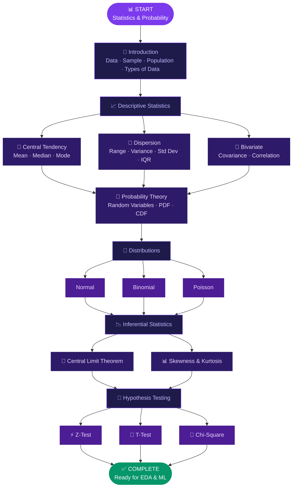
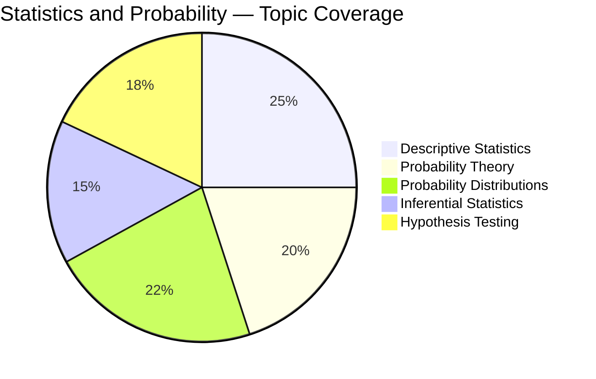
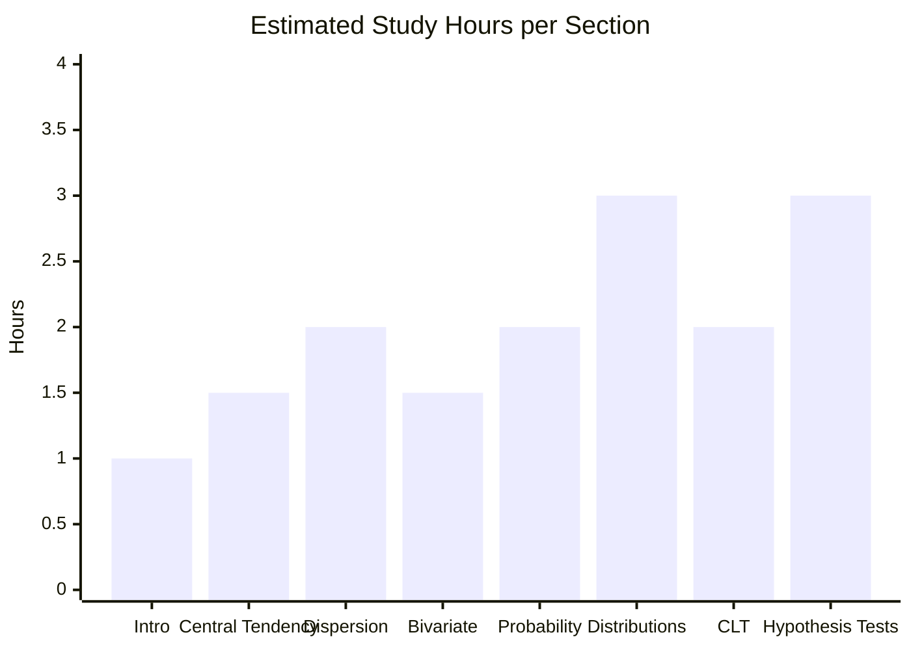
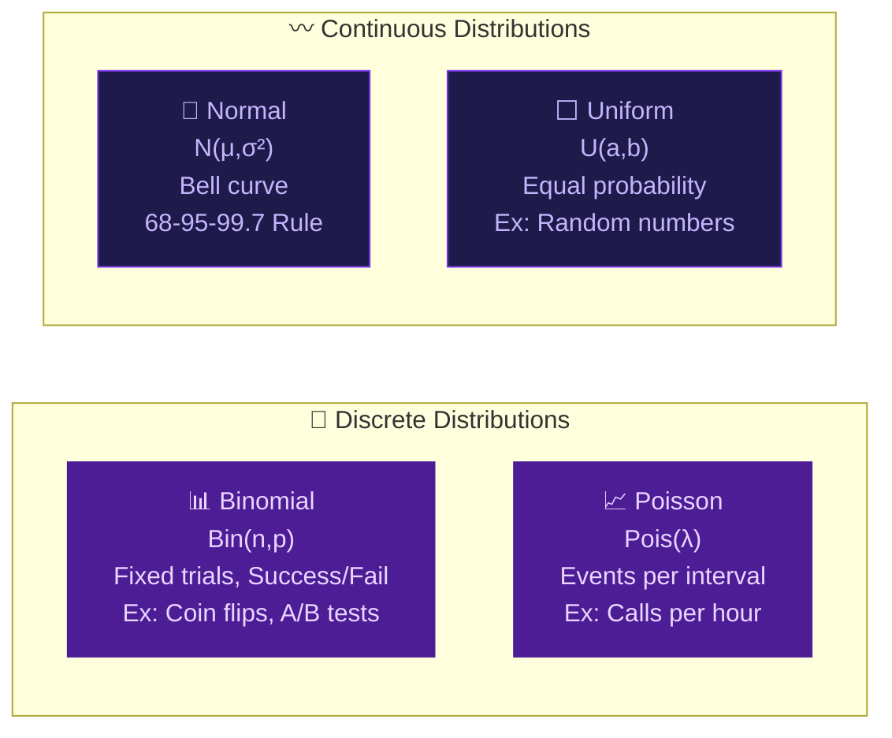
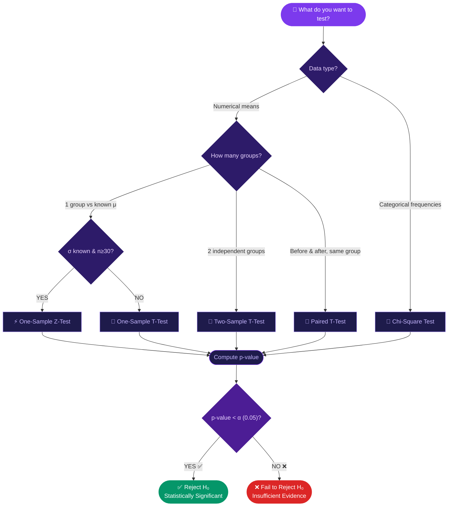

<div align="center">

<!-- ANIMATED TYPING HEADER -->


<br/>


<br/>

<p>
  
  
  
  
  
</p>

<p>
  
  
  
  
  
</p>

<br/>

> ### 🎯 *"Statistics is the grammar of science"* — Karl Pearson
>
> Complete **Statistics & Probability** foundation required for Data Science —
> from central tendency all the way to hypothesis testing & distributions.

</div>

---

## 📚 Table of Contents

| # | Section | Link |
|---|---------|------|
| 01 | 🗺️ Module Overview | [Jump](#️-module-overview) |
| 02 | 🧭 Learning Roadmap | [Jump](#-learning-roadmap) |
| 03 | 📖 Topic Deep Dive | [Jump](#-topic-deep-dive) |
| 04 | 📊 Coverage Charts | [Jump](#-coverage-charts) |
| 05 | 🔬 Probability Distributions | [Jump](#-probability-distributions-at-a-glance) |
| 06 | 🧪 Hypothesis Testing Guide | [Jump](#-hypothesis-testing-decision-guide) |
| 07 | 📐 Formulas Cheatsheet | [Jump](#-key-formulas-cheatsheet) |
| 08 | 📁 Folder Structure | [Jump](#-folder-structure) |
| 09 | 🛠️ Tools & Libraries | [Jump](#️-tools--libraries) |
| 10 | 🚀 Getting Started | [Jump](#-getting-started) |

---

## 🗺️ Module Overview

<div align="center">

| 📌 Attribute | 📋 Details |
|-------------|-----------|
| 🎓 **Parent Course** | Data Science Full Course — WsCube Tech |
| 📂 **Module Name** | Statistics & Probability |
| 📍 **Position** | Module 14–15 (Core DS Foundation) |
| ⏱️ **Duration** | 2–3 Weeks · 15+ Hours |
| 📓 **Notebooks** | 12+ Jupyter Notebooks |
| 🎯 **Why It Matters** | Every ML algorithm is built on statistics |
| 🔗 **Leads To** | EDA → Machine Learning → Model Evaluation |

</div>

---

## 🧭 Learning Roadmap



---

## 📖 Topic Deep Dive

### 🔷 PART 1 — Descriptive Statistics

#### 📍 Measures of Central Tendency

| Measure | Formula | Best Used When | Notebook |
|---------|---------|---------------|:--------:|
| **Mean** | `Σx / n` | Symmetric data, no outliers | `02_central_tendency.ipynb` |
| **Median** | Middle value when sorted | Skewed data or outliers | `02_central_tendency.ipynb` |
| **Mode** | Most frequent value | Categorical data | `02_central_tendency.ipynb` |

#### 📏 Measures of Dispersion

| Measure | Formula | What It Shows | Notebook |
|---------|---------|--------------|:--------:|
| **Range** | `Max − Min` | Total spread | `03_dispersion.ipynb` |
| **Variance** | `Σ(x−μ)² / n` | Avg squared deviation from mean | `03_dispersion.ipynb` |
| **Std Dev** | `√Variance` | Spread in original units | `03_dispersion.ipynb` |
| **IQR** | `Q3 − Q1` | Middle 50% spread, outlier-robust | `03_dispersion.ipynb` |

#### 🔗 Bivariate Analysis

| Concept | Range | Interpretation | Notebook |
|---------|-------|---------------|:--------:|
| **Covariance** | `-∞ to +∞` | Direction of linear relationship | `04_bivariate.ipynb` |
| **Pearson r** | `-1 to +1` | Strength + direction | `04_bivariate.ipynb` |

---

### 🔷 PART 2 — Probability & Distributions

| Concept | Key Idea | Notebook |
|---------|---------|:--------:|
| **Random Variable** | Value determined by random experiment | `05_probability.ipynb` |
| **PDF** | Probability for continuous variables | `05_probability.ipynb` |
| **CDF** | Probability that X ≤ x | `05_probability.ipynb` |
| **Normal Distribution** | Bell curve — most important distribution | `06_normal_dist.ipynb` |
| **Binomial Distribution** | Success/failure over n trials | `07_binomial_dist.ipynb` |
| **Poisson Distribution** | Count of events in a fixed interval | `08_poisson_dist.ipynb` |
| **Skewness** | Asymmetry of distribution around mean | `09_skewness.ipynb` |

---

### 🔷 PART 3 — Inferential Statistics & Hypothesis Testing

| Concept | Key Idea | Notebook |
|---------|---------|:--------:|
| **Central Limit Theorem** | Sample means → normal regardless of population | `10_CLT.ipynb` |
| **Null Hypothesis H₀** | Default claim — no effect exists | `11_hypothesis.ipynb` |
| **Alternate Hypothesis H₁** | What we aim to prove | `11_hypothesis.ipynb` |
| **p-value** | Probability of results if H₀ is true | `11_hypothesis.ipynb` |
| **Significance Level α** | Threshold (0.05) to reject H₀ | `11_hypothesis.ipynb` |
| **Confidence Interval** | Range containing true param with (1−α)% certainty | `11_hypothesis.ipynb` |
| **Z-Test** | Test mean when σ known, n ≥ 30 | `12_zttest.ipynb` |
| **T-Test** | Test mean when σ unknown or small n | `12_zttest.ipynb` |
| **Chi-Square Test** | Independence between categorical variables | `13_chi_square.ipynb` |

---

## 📊 Coverage Charts

```mermaid
gantt
    title Module Position in Full Course
    dateFormat  X
    axisFormat  Module %s

    section Python
    Python Fundamentals     :done, m1, 1, 5
    Web Scraping            :done, m2, 5, 6

    section Data Science
    Intro to Data Science   :done, m3, 6, 7
    Statistics and Prob     :active, m4, 7, 9

    section Data Layer
    NumPy                   :  m5, 9, 10
    Pandas                  :  m6, 10, 12

    section Visualization
    Matplotlib and Seaborn  :  m7, 12, 14

    section ML
    Machine Learning        :  m8, 14, 22
```







---

## 🔬 Probability Distributions at a Glance



### Distribution Properties Table

| Distribution | Type | Parameters | Mean | Variance | Real-World Use |
|-------------|------|-----------|------|----------|----------------|
| 🔔 **Normal** | Continuous | μ, σ | μ | σ² | Heights, test scores, measurement error |
| 📊 **Binomial** | Discrete | n, p | np | np(1−p) | Coin flips, pass/fail, click-through rates |
| 📈 **Poisson** | Discrete | λ | λ | λ | Calls/hour, bugs/file, accidents/day |
| ⬜ **Uniform** | Continuous | a, b | (a+b)/2 | (b−a)²/12 | Random number generation |

---

## 🧪 Hypothesis Testing Decision Guide



### Tests Quick-Reference

| Test | Use Case | Condition | Python Function |
|------|---------|-----------|----------------|
| ⚡ **Z-Test** | 1 mean vs known μ | σ known, n ≥ 30 | `statsmodels.stats.weightstats.ztest` |
| 📐 **1-Sample T** | 1 mean vs value | σ unknown / small n | `scipy.stats.ttest_1samp` |
| 📐 **2-Sample T** | Compare two groups | Independent | `scipy.stats.ttest_ind` |
| 📐 **Paired T** | Before vs after | Same group | `scipy.stats.ttest_rel` |
| 🔲 **Chi-Square** | Categorical association | Expected freq ≥ 5 | `scipy.stats.chi2_contingency` |

---

## 📐 Key Formulas Cheatsheet

<div align="center">

| 📌 Concept | 🔢 Formula |
|-----------|-----------|
| **Population Mean** | `μ = Σxᵢ / N` |
| **Sample Mean** | `x̄ = Σxᵢ / n` |
| **Population Variance** | `σ² = Σ(xᵢ − μ)² / N` |
| **Sample Variance** | `s² = Σ(xᵢ − x̄)² / (n−1)` |
| **Standard Deviation** | `σ = √σ²` |
| **Z-Score** | `z = (x − μ) / σ` |
| **Covariance** | `Cov(X,Y) = Σ(xᵢ−x̄)(yᵢ−ȳ) / (n−1)` |
| **Pearson Correlation** | `r = Cov(X,Y) / (σₓ · σᵧ)` |
| **Binomial PMF** | `P(X=k) = C(n,k) · pᵏ · (1−p)ⁿ⁻ᵏ` |
| **Poisson PMF** | `P(X=k) = (λᵏ · e⁻λ) / k!` |
| **Normal PDF** | `f(x) = (1/σ√2π) · e^(−(x−μ)²/2σ²)` |
| **Z-Test Statistic** | `z = (x̄ − μ₀) / (σ/√n)` |
| **T-Test Statistic** | `t = (x̄ − μ₀) / (s/√n)` |
| **Confidence Interval** | `x̄ ± z*(σ/√n)` |

</div>

---

## 📁 Folder Structure

```
📂 Statistics and Probability/
│
├── 📓 01_intro_to_statistics.ipynb
├── 📓 02_measures_central_tendency.ipynb
├── 📓 03_measures_of_dispersion.ipynb
├── 📓 04_bivariate_analysis.ipynb
├── 📓 05_probability_fundamentals.ipynb
├── 📓 06_normal_distribution.ipynb
├── 📓 07_binomial_distribution.ipynb
├── 📓 08_poisson_distribution.ipynb
├── 📓 09_skewness_and_kurtosis.ipynb
├── 📓 10_central_limit_theorem.ipynb
├── 📓 11_hypothesis_testing_basics.ipynb
├── 📓 12_z_test_and_t_test.ipynb
├── 📓 13_chi_square_test.ipynb
└── 📄 README.md
```

---

## 🛠️ Tools & Libraries

<div align="center">

| 📦 Library | 🎯 Purpose | 💡 Key Functions |
|-----------|-----------|-----------------|
|  | Numerical computing | `np.mean()`, `np.std()`, `np.random.*` |
|  | Data manipulation & summary stats | `df.describe()`, `df.corr()`, `df.cov()` |
|  | Static visualizations | `plt.hist()`, `plt.boxplot()` |
|  | Statistical visualizations | `sns.distplot()`, `sns.heatmap()` |
|  | Statistical tests | `ttest_ind`, `chi2_contingency`, `norm` |
|  | Advanced statistics | `ztest()`, `OLS()` |

</div>

---

## 🚀 Getting Started

```bash
git clone https://github.com/MuhammadZafran33/Data-Science-Course.git
cd "Data-Science-Course/Data Science Full Course By WsCube Tech/Statistics and Probability"
pip install numpy pandas matplotlib seaborn scipy statsmodels jupyter
jupyter notebook
```

[](https://colab.research.google.com/github/MuhammadZafran33/Data-Science-Course/)

---

## 🔗 Navigation

<div align="center">

| ⬅️ Previous | 📍 You Are Here | ➡️ Next |
|------------|----------------|--------|
| [🌐 Web Scraping](../Web%20Scraping/) | **📊 Statistics & Probability** | [🔢 NumPy →](../NumPy/) |

</div>

---

<div align="center">

[](https://github.com/MuhammadZafran33)


> *"Statistical thinking will one day be as necessary for efficient citizenship as the ability to read and write."*
> **— H.G. Wells**

**⭐ Star the repo if this helped! ⭐**


</div>
