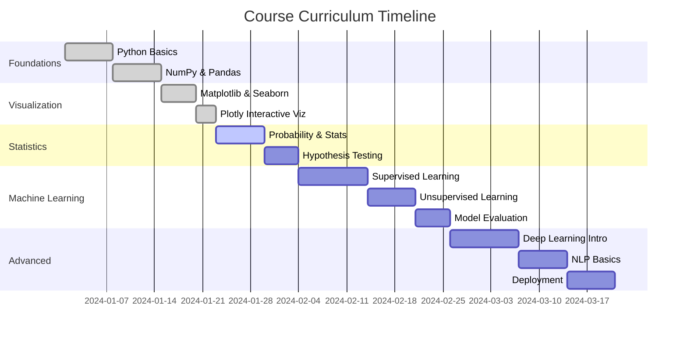
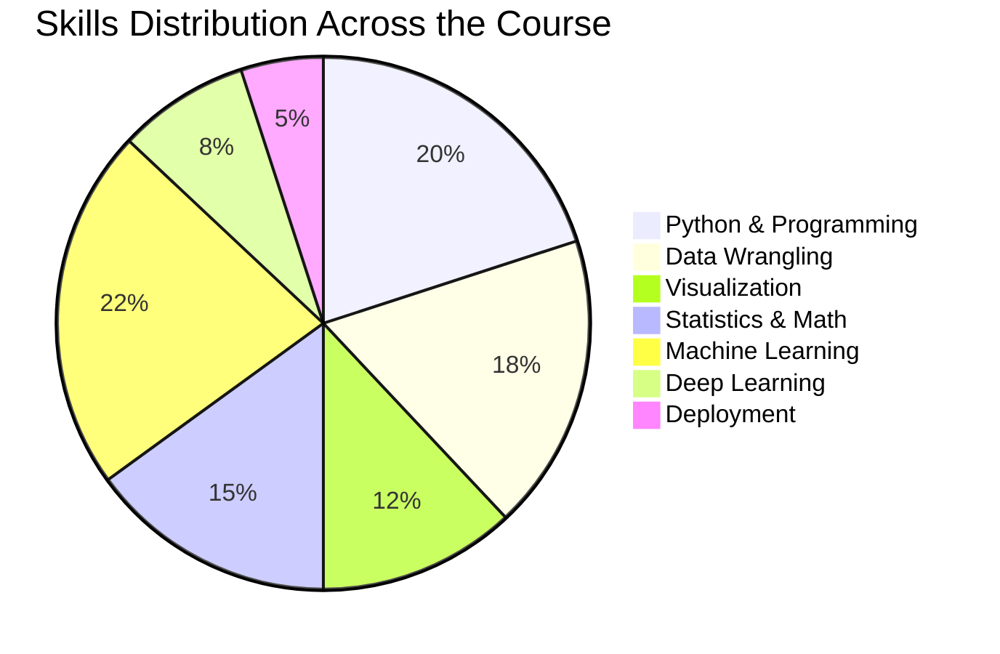
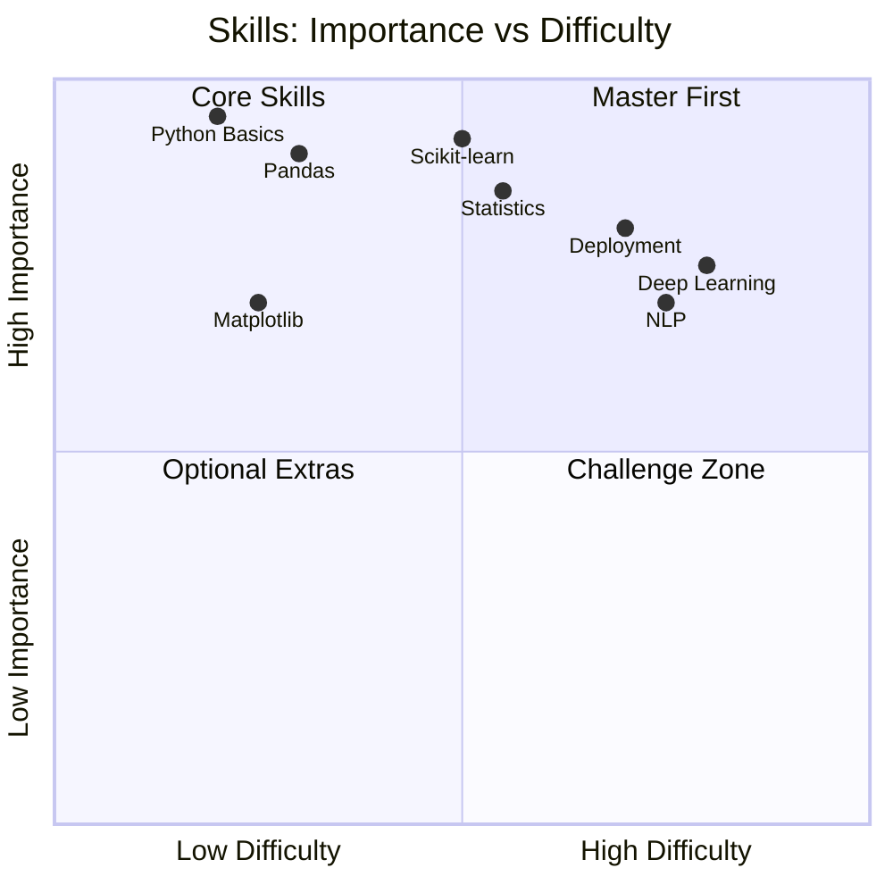
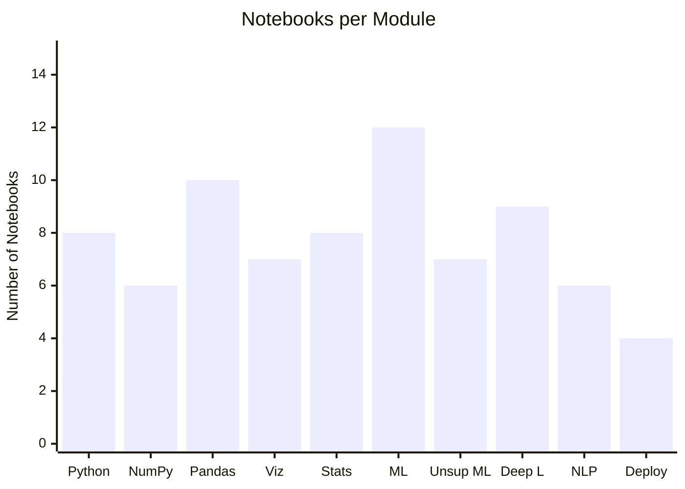

<div align="center">

<!-- ANIMATED HEADER BANNER -->


<!-- BADGES ROW -->
<p>
  
  
  
  
  
</p>

<p>
  
  
  
</p>

> **A comprehensive, hands-on journey through the complete Data Science pipeline — from raw data to production-ready models.**

</div>

---

## 📚 Table of Contents

- [🌟 About the Course](#-about-the-course)
- [🗺️ Learning Roadmap](#-learning-roadmap)
- [📦 Course Modules](#-course-modules)
- [🛠️ Tech Stack](#-tech-stack)
- [📊 Skills You'll Master](#-skills-youll-master)
- [🚀 Getting Started](#-getting-started)
- [📁 Folder Structure](#-folder-structure)
- [🏆 Projects & Milestones](#-projects--milestones)
- [📬 Connect](#-connect)

---

## 🌟 About the Course

This repository is a **complete, self-paced Data Science curriculum** structured to take you from the fundamentals of Python all the way through advanced machine learning and real-world deployment.

Whether you're a **complete beginner** or someone looking to **level up** their skills, every module is designed with clarity, code, and practice in mind.

| 🎯 Goal | 📅 Duration | 🧑‍💻 Level | 💡 Format |
|--------|-----------|---------|---------|
| Become a job-ready Data Scientist | 12–16 Weeks | Beginner → Advanced | Notebooks + Projects |

---

## 🗺️ Learning Roadmap


---

## 📦 Course Modules

### Module Breakdown & Progress



### 📋 Detailed Module Overview

| # | Module | Topics Covered | Notebooks | Difficulty |
|---|--------|---------------|-----------|------------|
| 01 | 🐍 **Python Fundamentals** | Variables, loops, functions, OOP | 8 | `⭐ Beginner` |
| 02 | 🔢 **NumPy** | Arrays, broadcasting, linear algebra | 6 | `⭐ Beginner` |
| 03 | 🐼 **Pandas** | DataFrames, groupby, merging, cleaning | 10 | `⭐⭐ Easy` |
| 04 | 📊 **Matplotlib & Seaborn** | Line, bar, heatmap, pairplot | 7 | `⭐⭐ Easy` |
| 05 | 📉 **Statistics** | Distributions, CLT, z-scores, p-values | 8 | `⭐⭐⭐ Medium` |
| 06 | 🤖 **Supervised ML** | Regression, classification, SVM, trees | 12 | `⭐⭐⭐ Medium` |
| 07 | 🌀 **Unsupervised ML** | K-Means, PCA, DBSCAN | 7 | `⭐⭐⭐ Medium` |
| 08 | 🧠 **Deep Learning** | ANN, CNN, RNN with Keras | 9 | `⭐⭐⭐⭐ Hard` |
| 09 | 💬 **NLP** | Tokenization, TF-IDF, sentiment analysis | 6 | `⭐⭐⭐⭐ Hard` |
| 10 | 🚀 **Deployment** | Flask APIs, Streamlit dashboards | 4 | `⭐⭐⭐⭐⭐ Expert` |

---

## 🛠️ Tech Stack

<div align="center">

| Category | Tools |
|----------|-------|
| **Language** |  |
| **Notebooks** |   |
| **Data** |   |
| **Viz** |    |
| **ML** |  |
| **DL** |   |
| **Deployment** |   |

</div>

---

## 📊 Skills You'll Master



### 🎓 Competency Map



---

## 🚀 Getting Started

### 1. Clone the Repository

```bash
git clone https://github.com/MuhammadZafran33/Data-Science-Course.git
cd Data-Science-Course
```

### 2. Create a Virtual Environment

```bash
python -m venv venv
source venv/bin/activate        # macOS / Linux
venv\Scripts\activate           # Windows
```

### 3. Install All Dependencies

```bash
pip install -r requirements.txt
```

### 4. Launch Jupyter Notebook

```bash
jupyter notebook
```

> 💡 **Tip:** Prefer the cloud? Open any notebook instantly in [](https://colab.research.google.com/)

---

## 📁 Folder Structure

```
📦 Data-Science-Course
├── 📂 01_Python_Basics
│   ├── 📓 01_variables_and_types.ipynb
│   ├── 📓 02_control_flow.ipynb
│   └── 📓 03_functions_and_oop.ipynb
├── 📂 02_NumPy
│   ├── 📓 01_arrays_and_indexing.ipynb
│   └── 📓 02_linear_algebra.ipynb
├── 📂 03_Pandas
│   ├── 📓 01_dataframes.ipynb
│   ├── 📓 02_data_cleaning.ipynb
│   └── 📓 03_groupby_and_merge.ipynb
├── 📂 04_Visualization
│   ├── 📓 01_matplotlib_basics.ipynb
│   └── 📓 02_seaborn_plots.ipynb
├── 📂 05_Statistics
│   └── 📓 01_probability_and_distributions.ipynb
├── 📂 06_Machine_Learning
│   ├── 📓 01_linear_regression.ipynb
│   ├── 📓 02_classification.ipynb
│   └── 📓 03_model_evaluation.ipynb
├── 📂 07_Deep_Learning
│   └── 📓 01_neural_networks_keras.ipynb
├── 📂 08_NLP
│   └── 📓 01_text_processing.ipynb
├── 📂 09_Projects
│   ├── 📁 01_EDA_Project
│   ├── 📁 02_ML_Project
│   └── 📁 03_Capstone
├── 📄 requirements.txt
└── 📄 README.md
```

---

## 🏆 Projects & Milestones

| # | Project | Description | Skills Used | Status |
|---|---------|-------------|-------------|--------|
| 🥉 | **Exploratory Data Analysis** | Analyze a real-world dataset end-to-end | Pandas, Seaborn | ✅ Done |
| 🥈 | **Predictive ML Model** | Build & tune a classification model | Scikit-learn | ✅ Done |
| 🥇 | **Capstone Project** | Full pipeline: data → model → dashboard | All skills | 🚧 In Progress |

---

## 📈 Course Progress Overview



---

## 📬 Connect

<div align="center">

[](https://github.com/MuhammadZafran33)
[](https://linkedin.com)
[](mailto:your@email.com)

</div>

---

<div align="center">

**⭐ Star this repo if it helped you! Every star fuels more content. ⭐**


</div>
